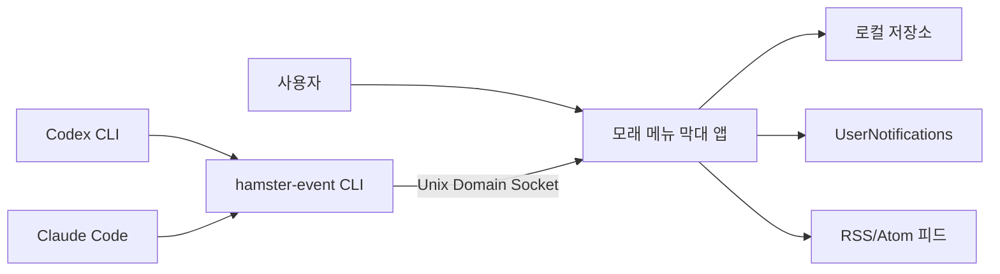
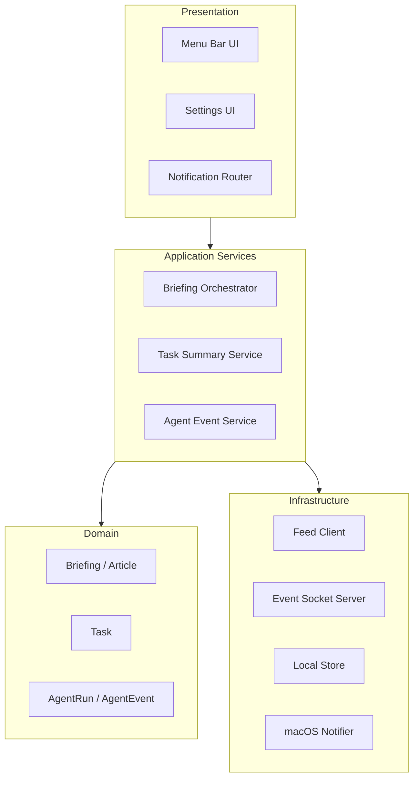
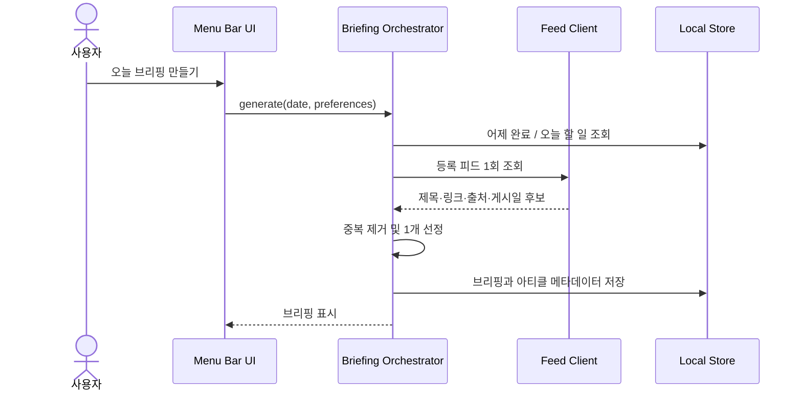
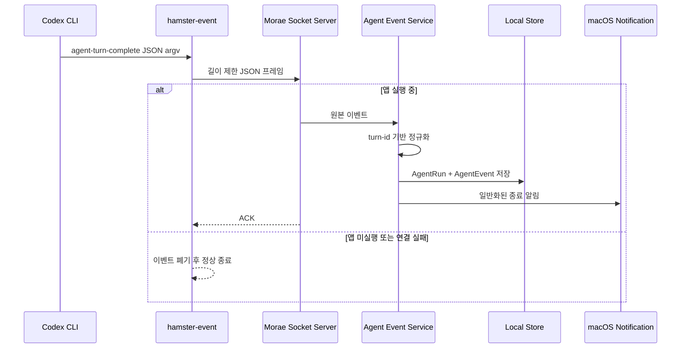
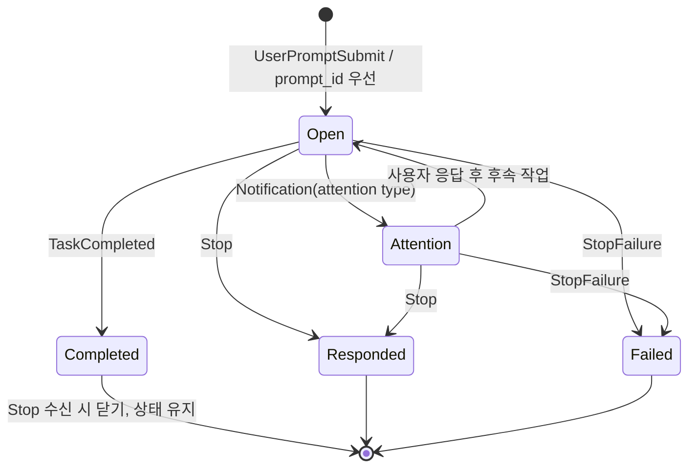
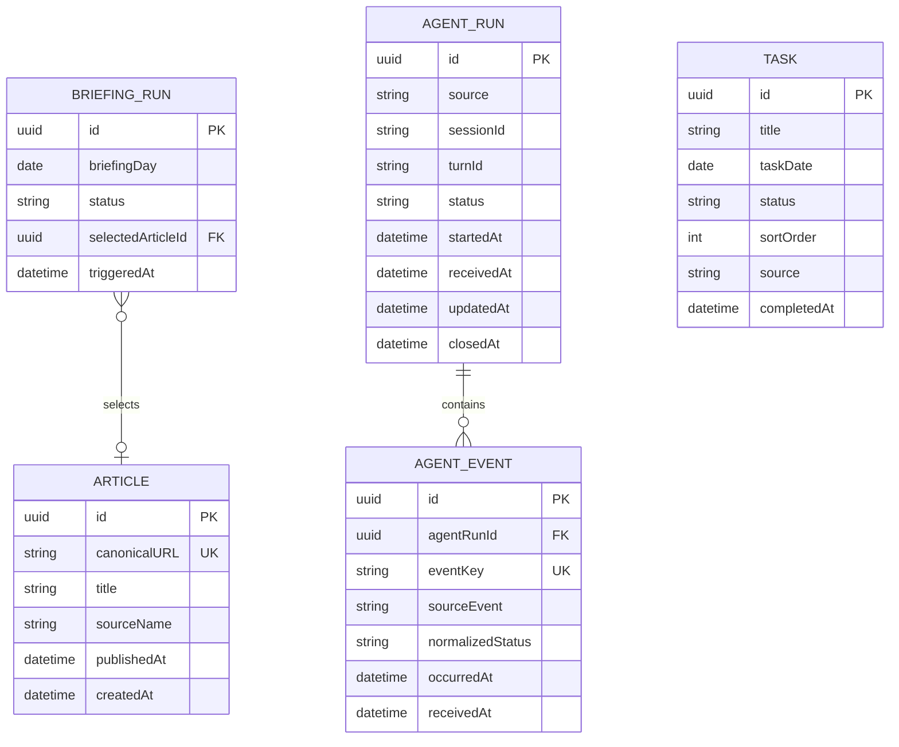

# 모래 High-Level Design

> 상태: Accepted  
> 최종 수정: 2026-07-30
> 대상: MVP  
> 상위 요구사항: [README](../README.md)  
> 상세 설계: [LLD](LLD.md)

## 1. 목적

이 문서는 macOS 개인 비서 "모래" MVP의 상위 수준 구조, 컴포넌트 책임, 데이터 흐름, 보안 경계와 운영 방식을 정의합니다.

MVP가 제공하는 사용자 가치는 다음 세 가지입니다.

1. 모래에 기록한 어제 한 일과 오늘 할 일을 메뉴 막대에서 요약해 보여준다.
2. 사용자가 직접 요청했을 때 최근 프론트엔드 아티클 한 개를 선정하고 원문 링크를 제공한다.
3. 앱 실행 중 수신한 Codex 응답 종료와 Claude Code 응답 종료·완료·실패 이벤트를 기록하고 알린다.

## 2. 범위

### 2.1 MVP 포함

- macOS 14 이상에서 동작하는 Swift/SwiftUI 메뉴 막대 앱
- 로컬 할 일 생성, 수정, 완료, 삭제와 날짜별 요약
- 수동 브리핑 트리거
- RSS/Atom 메타데이터 수집과 아티클 선정
- Codex `notify`와 Claude Code Hook용 `hamster-event` CLI
- 앱 실행 중 Unix Domain Socket을 통한 best-effort 이벤트 수신
- 정규화된 에이전트 이벤트의 로컬 저장
- 민감한 내용을 숨긴 macOS 알림
- 선택적인 로그인 시 자동 실행

### 2.2 MVP 제외

- WidgetKit 위젯과 마스코트 애니메이션
- 예약 브리핑, 백그라운드 RSS 수집, 자동 재시도
- AI 기반 아티클 요약과 아티클 원문 HTML 수집
- 계정, 서버, 클라우드 동기화
- 앱이 종료된 동안 발생한 에이전트 이벤트 복구
- Codex 작업 시작·진행·승인·실패 추적
- 외부 캘린더, 미리 알림, GitHub, Notion 연동
- 알림에서 특정 작업 상세 화면으로 바로 이동
- 에이전트 작업 실행 또는 제어

### 2.3 현재 전달 상태

Sprint 0, Sprint 1, Sprint 1.5, Sprint 2와 Sprint 3가 구현됐습니다. 현재 실행
가능한 범위는 메뉴 막대 앱 셸, GRDB/SQLite 영구 저장, 할 일
CRUD·완료·재정렬·이월, 어제 완료 요약과 소프트 블루 기반 light/dark
UI입니다. 아티클 영역은 기본 피드 seed, 제한된 HTTPS client, RSS/Atom
메타데이터 파싱, URL 정규화·중복 제거·선정과 로컬 저장소까지
구현됐습니다. 수동 브리핑은 사용자 버튼 동작에만 최대 4개 피드를
조회하고 로컬 요약·추천 링크를 저장하며, 실패 시 자동 재시도하지 않고
재시작 후 같은 날짜의 최신 결과를 복원합니다. 기본 소스는 GeekNews,
FE News, Frontend Focus와 JavaScript Weekly이며 소스별 큐레이션
가중치를 선정 점수에 반영합니다.

에이전트 IPC·알림, 설정과 배포는 Sprint 4~6에서 구현합니다. 앱 실행이나
메뉴 열기만으로 피드 네트워크 요청이나 이벤트 수신을 시작하지 않습니다.

## 3. 아키텍처 드라이버

| 드라이버 | 설계에 미치는 영향 |
| --- | --- |
| 로컬 우선 | 사용자 데이터와 에이전트 이벤트는 로컬 DB에 저장하고 서버를 두지 않는다. |
| 단순한 설치와 운영 | 하나의 `.app` 번들에 메뉴 막대 앱과 `hamster-event`를 포함한다. |
| 추가 연동 비용 없음 | Codex App Server 대신 `notify`, Claude Code는 로컬 Hook을 사용한다. |
| 명시적 네트워크 사용 | 사용자가 브리핑 버튼을 누를 때만 RSS/Atom 피드를 가져온다. |
| 개인정보 최소화 | 원본 에이전트 payload는 메모리에서 처리한 뒤 폐기하고 최소 메타데이터만 저장한다. |
| 확장 가능한 로컬 구조 | MVP는 모듈형 모놀리스로 구현하되 향후 WidgetKit, 외부 연동, 내구성 있는 이벤트 수집을 추가할 수 있게 경계를 둔다. |

## 4. 시스템 컨텍스트



외부 네트워크 경계는 RSS/Atom 피드 서버뿐입니다. 에이전트 이벤트와 아티클 원문은 외부 서비스로 전송하지 않습니다.

## 5. 배포 구조

```text
모래.app
└── Contents
    ├── MacOS
    │   ├── Morae
    │   └── hamster-event
    ├── Resources
    └── Info.plist
```

| 배포 단위 | 역할 |
| --- | --- |
| `Morae` | `MenuBarExtra` UI, 도메인 로직, 로컬 저장소, 소켓 서버, 알림 |
| `hamster-event` | Codex/Claude 원본 이벤트를 읽어 실행 중인 앱으로 전달하는 일회성 CLI |

- 앱은 본인 전용 DMG로 만들고 로컬 실행용 서명(`Sign to Run Locally` 또는 ad-hoc)을 사용합니다.
- Developer ID 서명과 공증은 MVP에서 하지 않으며 타인에게 배포해야 할 때 별도로 도입합니다.
- App Store 배포와 App Sandbox는 MVP 범위에서 제외합니다.
- 사용자는 온보딩에서 Codex와 Claude 설정 스니펫을 직접 복사해 붙여넣습니다.
- 앱 이동으로 실행 파일 경로가 달라질 수 있으므로 설정 화면에서 현재 설치 경로와 설정 스니펫을 다시 확인할 수 있어야 합니다.
- 로컬 저장소는 사용자 Application Support 디렉터리와 표준 `UserDefaults`를 사용합니다.
- 향후 WidgetKit을 추가하면 App Group과 기존 데이터 이전을 별도 결정합니다.

## 6. 애플리케이션 구조

MVP는 단일 앱 프로세스 안에서 기능별 경계를 둔 모듈형 모놀리스로 구성합니다.



### 6.1 Presentation

| 컴포넌트 | 책임 |
| --- | --- |
| Menu Bar UI | 오늘 브리핑, 할 일, 최근 에이전트 기록과 미확인 상태 표시 |
| Settings UI | 관심 분야, RSS 피드, 로그인 실행, 개인정보 옵션, Hook 설정 스니펫 관리 |
| Notification Router | 알림 선택 시 최근 에이전트 기록 목록을 연다. 2단계에서 상세 딥링크로 확장한다. |

### 6.2 Application Services

| 서비스 | 책임 |
| --- | --- |
| Briefing Orchestrator | 수동 브리핑 한 회의 피드 수집→선정→저장 흐름 조정 |
| Task Summary Service | 로컬 Task를 날짜와 완료 상태로 집계한다. |
| Agent Event Service | 원본 이벤트 정규화, 턴 연결, 상태 전이, 중복 억제, 저장, 알림 조정 |

### 6.3 Infrastructure

| 컴포넌트 | 책임 |
| --- | --- |
| Feed Client | 등록된 RSS/Atom 피드를 병렬로 가져와 제목, 링크, 출처와 게시일을 파싱한다. |
| Event Socket Server | 사용자 전용 Unix Domain Socket을 열고 이벤트 프레임을 수신한다. |
| Local Store | Task, Article, BriefingRun, AgentRun, AgentEvent를 트랜잭션으로 저장한다. |
| macOS Notifier | 사용자 권한과 개인정보 설정에 맞춰 로컬 알림을 생성한다. |

## 7. 주요 런타임 흐름

### 7.1 수동 브리핑



규칙:

- 사용자 동작 한 번당 브리핑 실행은 한 번입니다.
- 피드 네트워크 오류가 발생해도 자동·수동 재시도 버튼을 제공하지 않습니다.
- 다음 "오늘 브리핑 만들기" 동작은 새로운 실행입니다.
- 할 일 요약은 항상 로컬에서 만들며 피드 실패와 독립적으로 표시합니다.
- 동일 날짜에 여러 번 실행하면 최신 결과를 표시합니다. 이전 BriefingRun과 Article은 MVP에서 자동 삭제하지 않으며 앱 데이터 초기화 또는 후속 정리 정책 도입 전까지 유지합니다.

### 7.2 Codex 이벤트



Codex MVP는 `agent-turn-complete → responded`만 지원합니다.

### 7.3 Claude Code 이벤트와 턴 연결



턴 연결 규칙:

1. `UserPromptSubmit`을 받으면 `prompt_id`를 `turnId`로 사용합니다. 필드가 없을 때만 UUID를 생성합니다.
2. 후속 `Notification`, `TaskCompleted`, `Stop`, `StopFailure`는 같은 `prompt_id`의 턴에 연결합니다.
3. `prompt_id`가 없으면 같은 세션의 최신 열린 턴을 사용하고, 열린 턴도 없다면 UUID 폴백 턴을 생성합니다.
4. `Stop`과 `StopFailure`는 턴을 닫습니다.
5. 상태 우선순위는 `failed > completed > responded > attention_required`입니다. `TaskCompleted` 뒤의 `Stop`은 상태를 낮추거나 중복 알림을 만들지 않습니다.
6. `Notification`은 `permission_prompt`, `elicitation_dialog`, `agent_needs_input`만 `attention_required`로 수신합니다.

## 8. 이벤트 수신 프로토콜

### 8.1 Transport

- Unix Domain Socket 스트림을 사용합니다.
- 소켓은 `$TMPDIR/morae-<uid>/event.sock` 아래에 생성합니다.
- 부모 디렉터리는 `0700`, 소켓은 `0600` 권한을 적용합니다.
- 앱 시작 시 이전에 남은 소켓 파일의 소유자가 현재 UID인지 확인한 뒤 교체합니다.
- 서버는 peer UID를 확인하고 현재 사용자와 다른 연결을 거부합니다.
- CLI는 process 시작 기준 900ms total deadline을 사용하고 연결 실패를 사용자 에이전트 작업의 실패로 전파하지 않습니다.

### 8.2 Framing

- 한 연결은 이벤트 한 개만 전달합니다.
- 프레임은 `4-byte big-endian payload length + UTF-8 JSON`으로 구성합니다.
- 원본 Hook/notify 입력은 760 KiB 이하, envelope JSON frame은 1 MiB 이하로 제한합니다.
- 알 수 없는 필드는 무시하고, 필수 필드가 없거나 크기 제한을 넘은 이벤트는 저장하지 않습니다.
- 앱은 저장 성공 후 ACK를 반환합니다. ACK 실패 시 CLI는 재전송하지 않습니다.
- CLI는 성공과 모든 전달 실패에서 stdout/stderr 출력 없이 exit code 0으로 종료해 에이전트 실행을 막지 않습니다.

### 8.3 정규화 형식

```json
{
  "schemaVersion": 1,
  "id": "event-uuid",
  "source": "codex",
  "sourceEvent": "agent-turn-complete",
  "status": "responded",
  "sessionId": "source-session-id",
  "turnId": "source-or-generated-turn-id",
  "occurredAt": "2026-07-24T14:30:00+09:00",
  "receivedAt": "2026-07-24T14:30:00+09:00",
  "projectPath": null,
  "title": null,
  "lastMessage": null
}
```

`projectPath`, `title`, `lastMessage`는 사용자가 각각 저장을 허용한 경우에만 영구 모델에 복사합니다.

## 9. 데이터 설계

### 9.1 논리 데이터 모델



### 9.2 무결성 규칙

- `AgentRun(source, sessionId, turnId)`는 고유합니다.
- `Article.canonicalURL`은 URL 정규화 후 고유합니다.
- 완료된 Task는 `completedAt`을 가져야 합니다.
- 이월 복사본은 새 ID를 사용하고 `source=carryover:<원본 task id>`로
  provenance를 남깁니다.
- 같은 대상 날짜와 같은 이월 원본 조합은 고유하며, 이미 이월한 원본은
  후보 목록에서 제외합니다.
- 원본 에이전트 payload, 피드 본문·요약과 아티클 HTML은 DB에 저장하지 않습니다.
- `BriefingRun` 저장과 선택된 `Article` 저장은 하나의 트랜잭션으로 처리합니다.
- 동일 이벤트가 재수신되면 소스 식별자 또는 안정적인 이벤트 fingerprint로 중복 저장을 방지합니다.
- `AgentRun.receivedAt`을 기준으로 90일이 지난 AgentRun과 하위 AgentEvent를 함께 삭제합니다.

### 9.3 저장소 선택

영구 저장은 GRDB 기반 SQLite로 구현하고 `LocalStore` 프로토콜 뒤에 숨깁니다.

GRDB를 선택한 이유:

- 명시적인 스키마 마이그레이션과 고유 제약을 정의할 수 있습니다.
- 트랜잭션 경계와 로컬 데이터 무결성을 직접 제어할 수 있습니다.
- 사용자 Application Support 디렉터리에 SQLite 파일을 배치할 수 있습니다.
- 테스트에서 임시 또는 in-memory 데이터베이스를 사용할 수 있습니다.

## 10. 아티클 메타데이터 수집과 선정

### 10.1 후보 수집

- 등록된 피드를 동시에 조회하되 호스트별 요청 수를 제한합니다.
- HTTP 캐시 헤더와 로컬 URL 중복 기록을 활용합니다.
- 후보를 게시 시점, 관심 분야, 기존 추천 여부, 공식 출처 여부로 점수화합니다.
- 유효 후보가 없으면 할 일 요약만 표시하고 "추천할 새 글이 없음" 상태를 저장합니다.

### 10.2 처리 범위

- RSS/Atom 항목에서 제목, 링크, 출처와 게시일만 읽습니다.
- 피드의 `description`, `summary`, `content`와 아티클 원문 HTML은 가져오거나 저장하지 않습니다.
- 아티클 링크는 사용자 선택 시 기본 브라우저에서 엽니다.
- AI API와 외부 본문 추출 서비스는 사용하지 않습니다.

## 11. 개인정보와 보안

### 11.1 에이전트 이벤트

- Hook/notify가 제공한 입력 메시지, 마지막 응답, 경로는 수신 과정에서 메모리에 존재할 수 있습니다.
- 기본 저장값은 source, sessionId, turnId, 상태, 이벤트 종류, 시각뿐입니다.
- 원본 payload, 전체 입력, 전체 응답, Claude transcript 경로는 처리 직후 폐기합니다.
- 프로젝트 경로, 제목, 마지막 응답 일부 저장은 각각 opt-in입니다.
- 기본 알림 본문은 에이전트 종류와 상태만 포함합니다.
- 에이전트 이벤트를 외부 서비스에 전송하지 않습니다.
- AgentRun과 하위 AgentEvent는 수신일로부터 90일이 지나면 자동 삭제합니다.
- 만료 정리는 앱 시작 시와 새 에이전트 이벤트 저장 후 수행하며 별도 백그라운드 스케줄러를 두지 않습니다.

### 11.2 로컬 입력 검증

- 소켓 peer UID, payload 크기와 JSON 스키마를 검증합니다.
- 원본 `projectPath`는 파일 접근 권한으로 사용하지 않고 표시용 데이터로만 취급합니다.
- 알림 제목과 본문은 길이를 제한하고 제어 문자를 제거합니다.
- 피드의 제목과 URL은 길이, 스킴과 제어 문자를 검증하고 코드 실행이나 파일 접근에 사용하지 않습니다.

## 12. 오류 처리

| 실패 | 사용자 동작 | 시스템 처리 |
| --- | --- | --- |
| 일부 피드 실패 | 없음 | 성공한 피드 후보만 사용하고 진단 로그 기록 |
| 모든 피드 실패 | 오류 상태 확인 | 할 일 요약은 표시하고 아티클 영역에 실패 표시 |
| DB 쓰기 실패 | 오류 확인 | 성공으로 표시하지 않고 로컬 진단 로그 기록 |
| 소켓 연결 실패 | 없음 | helper가 이벤트를 폐기하고 정상 종료 |
| 알림 권한 없음 | 설정 안내 | 메뉴 막대에 미확인 도트 표시 |
| 잘못된 Hook payload | 없음 | 저장하지 않고 민감 정보 없는 진단 카운터만 증가 |

## 13. 관측 가능성

MVP는 외부 분석 SDK를 사용하지 않습니다.

- OSLog 카테고리: `briefing`, `feed`, `event-ingress`, `storage`, `notification`
- 로그에 피드 본문, 에이전트 메시지와 프로젝트 전체 경로를 남기지 않습니다.
- 설정 화면에 로컬 진단 정보를 제공합니다.
  - 마지막 브리핑 실행 시각과 단계별 성공 여부
  - 소켓 서버 실행 여부
  - 마지막 에이전트 이벤트 수신 시각
  - 알림 권한 상태
  - DB 스키마 버전
- 진단 정보 내보내기는 MVP 이후로 둡니다.

## 14. 품질 속성 목표

아래 값은 초기 구현과 테스트를 위한 목표이며 외부 SLA가 아닙니다.

| 항목 | 목표 |
| --- | --- |
| 메뉴 막대 열기 | 로컬 데이터 기준 200ms 이내에 첫 화면 표시 |
| 이벤트 알림 | 앱 실행 중 이벤트 수신 후 1초 이내 알림 요청 |
| 앱 시작 | DB 마이그레이션 실패 시 데이터 손상 없이 오류 화면 표시 |
| 네트워크 | 브리핑 트리거 외에는 RSS/Atom 네트워크 요청 없음 |
| 접근성 | 메뉴 막대 핵심 기능에 VoiceOver 레이블과 키보드 탐색 제공 |
| 호환성 | macOS 14 이상 |

## 15. 테스트 전략

### 15.1 단위 테스트

- Task 날짜 경계와 어제/오늘 집계
- 피드 후보 점수와 중복 제거
- Codex/Claude 원본 이벤트 정규화
- Claude 세션별 `turnId` 연결과 상태 우선순위
- 개인정보 설정별 저장 필드 제거
- 에이전트 기록 90일 만료 경계와 하위 이벤트 cascade 삭제
- 피드 항목의 필수 메타데이터 검증

### 15.2 통합 테스트

- 임시 소켓에 `hamster-event`를 연결해 이벤트 저장까지 검증
- 앱 미실행 시 helper가 빠르게 정상 종료하는지 검증
- 임시 DB의 마이그레이션과 고유 제약 검증
- GRDB 읽기·쓰기 트랜잭션과 만료 정리 검증
- 자체 제작 fixture 기반 RSS/Atom 메타데이터 파싱 검증
- Stub URLProtocol 기반 피드 성공·실패 검증

### 15.3 수동 인수 테스트

[README의 MVP 완료 조건](../README.md#12-mvp-완료-조건)을 기준으로 새 사용자 온보딩부터 앱 재실행 후 데이터 유지까지 확인합니다.

## 16. 구현 순서

1. Xcode 프로젝트와 메뉴 막대 앱 셸
2. LocalStore와 Task 관리
3. 수동 브리핑 UI, 피드 수집과 로컬 Task 요약
4. `hamster-event`, 소켓 서버와 이벤트 정규화
5. macOS 알림과 미확인 상태
6. 설정 스니펫, 개인정보 옵션과 로그인 실행
7. 본인 전용 DMG 생성과 로컬 설치 인수 테스트

## 17. ADR

| ADR | 결정 |
| --- | --- |
| [ADR-0001](adr/0001-native-macos-modular-monolith.md) | 네이티브 macOS 모듈형 모놀리스와 개인용 배포 |
| [ADR-0002](adr/0002-best-effort-local-agent-event-ingestion.md) | UDS 기반 best-effort 에이전트 이벤트 수신 |
| [ADR-0003](adr/0003-manual-briefing-execution.md) | 수동 브리핑과 무재시도 정책 |
| [ADR-0004](adr/0004-agent-turn-identity-and-state.md) | 에이전트 턴 식별과 상태 정규화 |
| [ADR-0005](adr/0005-minimal-agent-event-persistence.md) | 원본 payload 비저장과 최소 필드 저장 |
| [ADR-0006](adr/0006-grdb-local-persistence.md) | GRDB 기반 SQLite 영구 저장 |
| [ADR-0007](adr/0007-local-article-content-extraction.md) | 원문 HTML 추출 결정(ADR-0010으로 대체) |
| [ADR-0008](adr/0008-agent-record-90-day-retention.md) | 에이전트 기록 90일 자동 보존 |
| [ADR-0009](adr/0009-personal-dmg-and-local-storage.md) | 본인 전용 DMG와 일반 사용자 저장소 |
| [ADR-0010](adr/0010-feed-metadata-only-article-recommendation.md) | 피드 메타데이터만 사용하는 아티클 추천 |
| [ADR-0011](adr/0011-soft-blue-native-menu-bar-visual-system.md) | 소프트 블루 기반 네이티브 메뉴 막대 시각 체계 |
| [ADR-0012](adr/0012-idempotent-todo-carry-over.md) | provenance 기반 할 일 이월 중복 방지 |
| [ADR-0013](adr/0013-curated-first-article-sources.md) | 큐레이션 우선 아티클 소스와 선정 가중치 |

## 18. 확정된 추가 결정

### D-001 로컬 영구 저장 기술

- 결정: GRDB + SQLite
- 근거: 고유 제약과 명시적 마이그레이션을 직접 제어하면서 일반 사용자 Application Support에 간단히 저장할 수 있습니다.
- 기록: [ADR-0006](adr/0006-grdb-local-persistence.md)

### D-002 아티클 처리 범위

- 결정: RSS/Atom의 제목, 링크, 출처와 게시일만 사용
- 근거: 비용과 개인정보 전송 없이 MVP의 최근 아티클 발견 목적을 가장 단순하게 충족합니다.
- 기록: [ADR-0010](adr/0010-feed-metadata-only-article-recommendation.md)

### D-003 에이전트 기록 보존 기간

- 결정: 최근 90일 자동 보존
- 근거: 월간·분기 회고 활용과 개인정보 최소화 사이의 절충안입니다.
- 기록: [ADR-0008](adr/0008-agent-record-90-day-retention.md)

### 구현 기본값

다음 항목은 MVP 구현 기본값으로 확정합니다.

- 로그인 시 자동 실행 기본값: 꺼짐
- 같은 날짜에 브리핑을 여러 번 만들면 목록에는 최신 실행만 표시하되 각 실행 결과는 자동 삭제하지 않음
- 기본 알림 내용: 에이전트 종류와 상태만 표시
- Claude Code 전체 Hook 호환 기준: 2.1.198 이상 (`prompt_id`만 사용하는 턴 연결은 2.1.196 이상)
- 피드 요청 제한 시간: 요청별 10초
