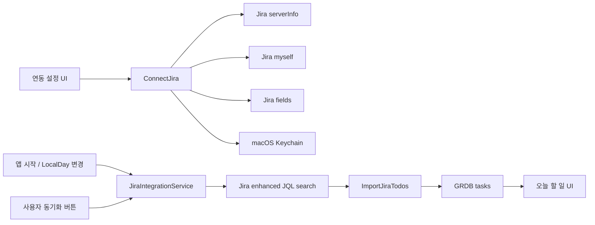

# 모래 Jira Cloud 연동 설계

> 상태: Implemented  
> 작성일: 2026-07-31  
> 대상: Sprint 7 구현 범위  
> 상위 설계: [HLD](HLD.md), [LLD](LLD.md)  
> 결정 기록: [ADR-0016](adr/0016-read-only-jira-daily-import.md)

## 1. 목적

모래가 사용자의 Jira Cloud 작업 중 지금 수행해야 할 항목을 오늘 할 일로
자동 가져옵니다. Jira를 작업 관리의 원본으로 유지하고 모래는 읽기 전용
개인 작업 화면으로 동작합니다.

가져올 대상은 다음 조건을 모두 만족하는 이슈입니다.

- 현재 Jira 사용자에게 할당됨
- Done 상태가 아님
- 이슈 타입이 Epic 또는 Initiative가 아님
- 상태가 Hold 또는 Backlog가 아님
- 아래 중 하나 이상에 해당
  - 상태 카테고리가 In Progress
  - 시작 날짜가 오늘 또는 과거
  - 기한이 오늘 또는 과거

## 2. 결정 요약

| 항목 | 결정 |
| --- | --- |
| Jira 쓰기 | 하지 않음. 모래 완료 상태를 Jira로 전송하지 않음 |
| 인증 | 1차 내부 프로토타입은 Atlassian 이메일 + 일반 API 토큰 |
| 비밀 저장 | API 토큰은 macOS Keychain에만 저장 |
| API URL | `serverInfo.baseUrl`의 기본 `*.atlassian.net` URL |
| 화면 링크 | `serverInfo.displayUrl`의 회사 커스텀 도메인 |
| 자동 실행 | 연결된 경우 앱 시작 및 날짜 변경마다 LocalDay당 최대 1회 |
| 재시도 | 자동 재시도 없음. 사용자가 누르는 수동 동기화만 별도 허용 |
| 동일 날짜 중복 | Jira issue ID + LocalDay로 DB에서 방지 |
| 다음 날짜 | Jira에서 계속 대상이면 새 날짜의 할 일로 다시 생성 |
| 로컬 완료 | 같은 날 재동기화가 완료 상태를 되돌리지 않음 |
| Jira 완료 | 기존 로컬 기록을 삭제하지 않고 다음 날짜부터 생성하지 않음 |
| 이월 | Jira 항목은 어제 미완료 가져오기 대상에서 제외 |
| 시작일 필드 | Jira field metadata에서 검색 가능한 date 필드를 식별해 ID로 조회 |

## 3. 범위

### 3.1 포함

- Jira Cloud 한 계정 연결과 연결 해제
- 커스텀 화면 URL에서 API용 기본 URL 자동 발견
- API 토큰 인증 검증
- 시작 날짜 필드 발견
- 오늘의 Jira 후보 조회
- 날짜별 로컬 Todo 생성과 같은 날짜 upsert
- Jira 출처·상태·기한 초과 표시
- Jira 이슈를 회사 화면 URL로 열기
- 자동 동기화 1회와 수동 동기화
- 오류 상태와 마지막 성공 시각 표시

### 3.2 제외

- Jira 이슈 생성, 상태 변경, 코멘트와 담당자 수정
- 모래 완료 상태를 Jira Done으로 전송
- 백그라운드 daemon, 앱 종료 중 동기화와 예약 실행
- 네트워크 실패 자동 재시도
- 여러 Jira 사이트 동시 연결
- 사용자가 직접 작성하는 임의 JQL
- Jira 웹훅
- OAuth 2.0 전환과 공개 배포 온보딩

## 4. 시스템 구조



새 컴포넌트 책임:

| 컴포넌트 | 책임 |
| --- | --- |
| `JiraClient` | serverInfo, myself, fields, JQL search 요청과 응답 제한 |
| `JiraCredentialStoring` | API 토큰 Keychain 저장·조회·삭제 |
| `JiraConnectionStoring` | 비밀이 아닌 연결 설정과 동기화 상태 저장 |
| `JiraStartDateFieldResolver` | 시작 날짜 custom field를 안정적인 ID로 결정 |
| `JiraCandidateQueryBuilder` | LocalDay와 field ID로 고정 JQL 생성 |
| `JiraIntegrationService` | 자동/수동 실행 정책, 조회, 단일 import transaction 조정 |
| `TodoRepository` | 날짜별 Jira 항목 idempotent upsert |

## 5. 연결과 인증

### 5.1 설정 입력

사용자가 입력하는 값:

- Jira 화면 URL
- Atlassian 관리 계정 이메일
- 일반 API 토큰

토큰에는 중간 구분이나 부분 입력 규칙이 없습니다. 생성 화면에서 복사한
전체 값을 사용합니다.

설정 UI는 다음 순서로 입력을 안내합니다.

1. 브라우저에서 사용하는 Jira 사이트 주소
2. Atlassian 계정 이메일
3. API token 전체 값
4. 연결 확인 및 Keychain 저장

API token 관리 화면 링크와 클립보드 붙여넣기 버튼을 제공하고, 인증
실패는 modal alert 대신 입력 영역 아래에 표시해 값을 유지한 채 다시
확인할 수 있게 합니다. 401은 이메일·토큰 조합을 확인하라는 메시지로
표시합니다.

### 5.2 연결 순서

1. 입력 URL을 trim하고 `https` URL인지 검증합니다.
2. 입력 URL의 `GET /rest/api/3/serverInfo`를 호출합니다.
3. `deploymentType == "Cloud"`인지 확인합니다.
4. 응답의 `baseUrl`을 API URL로, `displayUrl`을 화면 URL로 사용합니다.
5. API URL의 `GET /rest/api/3/myself`를 이메일과 토큰으로 호출합니다.
6. 인증 성공 후 `GET /rest/api/3/field`로 field metadata를 가져옵니다.
7. 시작 날짜 field를 결정합니다.
8. 연결 정보와 토큰을 저장합니다.

회사 사이트에서 커스텀 display URL과 기본 `*.atlassian.net` API URL이
서로 다르고 기본 API URL에서 인증되는 것을 확인했습니다. 실제 host는
코드·공유 문서의 상수로 고정하지 않고 각 사용자 Mac의 설정에만
저장합니다.

커스텀 화면 URL에는 전역 범위 API 토큰을 보내지 않습니다. 모든 인증
요청은 발견된 기본 `*.atlassian.net` API URL로 보냅니다.

### 5.3 Keychain

```swift
protocol JiraCredentialStoring: Sendable {
    func save(token: String, accountEmail: String) throws
    func load(accountEmail: String) throws -> String?
    func delete(accountEmail: String) throws
}
```

Keychain 속성:

```text
class:      generic password
service:    io.github.heejung-29cm.morae.jira
account:    normalized Atlassian email
accessible: afterFirstUnlockThisDeviceOnly
```

- 연결 검증이 성공하기 전에는 토큰을 영구 저장하지 않습니다.
- 토큰은 UserDefaults, SQLite, OSLog, 오류 메시지에 포함하지 않습니다.
- 연결 해제 시 Keychain 토큰을 먼저 삭제하고 연결 설정을 비활성화합니다.
- 기존 날짜의 Jira Todo는 로컬 기록으로 유지합니다.

## 6. 후보 선정 규칙

### 6.1 JQL

모래의 `LocalDay`를 `yyyy-MM-dd` date literal로 넣습니다. Jira profile
time zone에 의존하는 `startOfDay()` 대신 명시적 날짜를 사용합니다.

```jql
assignee = currentUser()
AND statusCategory != Done
AND issuetype NOT IN ("Epic", "Initiative")
AND status NOT IN ("Hold", "Backlog")
AND (
  statusCategory = "In Progress"
  OR cf[START_DATE_FIELD_ID] <= "2026-07-31"
  OR due <= "2026-07-31"
)
ORDER BY priority DESC, updated DESC
```

- `START_DATE_FIELD_ID`는 metadata에서 받은 숫자만 사용합니다.
- 날짜는 검증된 `LocalDay.rawValue`만 사용합니다.
- 사용자 입력 문자열을 JQL에 직접 삽입하지 않습니다.
- 시작 날짜 field를 찾지 못하면 In Progress 또는 기한 도래 조건만으로
  동기화하고 설정 화면에 제한 상태를 표시합니다.

### 6.2 시작 날짜 field 발견

`GET /rest/api/3/field` 결과에서 다음 순서로 결정합니다.

1. 저장된 field ID가 현재 응답에 있고 검색 가능한 date field면 재사용
2. `name` 또는 `untranslatedName`이 `Start date`와 정확히 일치
3. `schema.type == "date"`이고 `searchable == true`
4. 후보가 하나면 자동 선택
5. 후보가 여러 개면 설정 UI에서 사용자가 선택
6. 후보가 없으면 시작일 조건 없이 제한 동작

JQL에는 이름 대신 `cf[숫자 ID]`를 사용해 동일 이름 field와 이름 변경의
영향을 줄입니다.

### 6.3 결과 정렬

Jira 응답을 받은 뒤 앱에서 다음 우선순위로 초기 삽입 순서를 계산합니다.

1. In Progress
2. 기한이 지난 미완료
3. 시작일이 오래된 미완료
4. Jira가 `priority DESC, updated DESC`로 반환한 순서
5. issue key

사용자가 로컬에서 순서를 변경한 뒤에는 같은 날짜의 재동기화가 기존
`sortOrder`를 덮어쓰지 않습니다. 새 Jira 항목만 기존 목록 끝에 위 순서로
추가합니다. Jira priority를 모래의 이진 `important` 값으로 추측해
변환하지 않고 새 항목의 로컬 priority는 `normal`로 시작합니다.

## 7. Jira REST 계약

### 7.1 엔드포인트

| 목적 | 메서드와 경로 |
| --- | --- |
| 사이트 발견 | `GET /rest/api/3/serverInfo` |
| 인증 검증 | `GET /rest/api/3/myself` |
| field 발견 | `GET /rest/api/3/field` |
| 후보 검색 | `POST /rest/api/3/search/jql` |

검색은 enhanced JQL search를 사용합니다.

```json
{
  "jql": "<고정 규칙으로 생성한 JQL>",
  "fields": [
    "summary",
    "status",
    "issuetype",
    "duedate",
    "customfield_START_DATE_ID",
    "updated"
  ],
  "maxResults": 50
}
```

- `nextPageToken`이 있으면 다음 페이지를 조회합니다.
- 최대 200개까지만 메모리에 모읍니다.
- 200개 뒤에도 다음 페이지가 있으면 DB를 변경하지 않고
  `too_many_issues`로 종료합니다.
- 모든 페이지가 성공한 뒤 한 번의 DB transaction으로 반영합니다.
- 응답 body 상한은 2 MiB, 요청 timeout은 10초입니다.
- HTTP cache와 cookie를 사용하지 않는 ephemeral URLSession을 사용합니다.
- 자동 재시도와 지수 backoff를 구현하지 않습니다.

### 7.2 최소 DTO

```swift
struct JiraIssueDTO: Decodable, Sendable {
    let id: String
    let key: String
    let fields: Fields

    struct Fields: Decodable, Sendable {
        let summary: String
        let status: JiraStatusDTO
        let dueDate: String?
        let startDate: String?
        let updated: String
    }
}
```

description, comment, attachment, worklog, reporter와 사용자 프로필은
요청하거나 저장하지 않습니다.

## 8. Todo 도메인과 저장

### 8.1 도메인

```swift
enum TodoOrigin: Equatable, Sendable {
    case manual
    case carryOver(sourceID: TodoID)
    case jira(JiraTodoMetadata)
}

struct JiraTodoMetadata: Equatable, Sendable {
    let issueID: String
    let issueKey: String
    let statusCategory: String
    let statusName: String
    let startDay: LocalDay?
    let dueDay: LocalDay?
    let syncedAt: Date
}
```

`TodoItem`에 `origin`을 추가하고 기존 initializer 기본값은 `.manual`로
둬 기존 호출부의 단계적 이전을 허용합니다.

### 8.2 `v5_jira_task_origin`

```sql
ALTER TABLE tasks ADD COLUMN external_provider TEXT;
ALTER TABLE tasks ADD COLUMN external_id TEXT;
ALTER TABLE tasks ADD COLUMN external_key TEXT;
ALTER TABLE tasks ADD COLUMN external_status_category TEXT;
ALTER TABLE tasks ADD COLUMN external_status_name TEXT;
ALTER TABLE tasks ADD COLUMN external_start_day TEXT;
ALTER TABLE tasks ADD COLUMN external_due_day TEXT;
ALTER TABLE tasks ADD COLUMN external_synced_at_ms INTEGER;

CREATE UNIQUE INDEX idx_tasks_external_daily
ON tasks(task_day, external_provider, external_id)
WHERE external_provider IS NOT NULL
  AND external_id IS NOT NULL;

CREATE INDEX idx_tasks_external_provider
ON tasks(external_provider, external_id);
```

Jira 항목은 `source = 'jira'`, `external_provider = 'jira'`로 저장합니다.
기존 행은 모든 `external_*` column이 NULL이며 의미가 바뀌지 않습니다.

### 8.3 `v6_jira_daily_dismissal`

```sql
CREATE TABLE jira_task_dismissals (
    task_day       TEXT NOT NULL CHECK(length(task_day) = 10),
    issue_id       TEXT NOT NULL,
    PRIMARY KEY(task_day, issue_id)
) WITHOUT ROWID;
```

Jira Todo 삭제와 dismissal 삽입은 한 transaction에서 수행합니다.
동일 날짜 import는 dismissal에 존재하는 issue ID를 건너뛰고, undo insert는
dismissal을 먼저 제거합니다.

repository는 다음 불변식을 검증합니다.

- `external_provider == nil`이면 `external_*` metadata는 모두 nil
- `external_provider == "jira"`이면 issue ID, key, status와 sync 시각 필수
- `external_start_day`, `external_due_day`는 유효한 LocalDay 또는 nil
- Jira 화면 URL은 `displayUrl/browse/{percent-encoded issueKey}`
- issue ID는 날짜별 idempotency key이고 issue key는 표시용

## 9. 동기화 의미

### 9.1 같은 날짜

issue ID + LocalDay가 이미 있으면:

- title, Jira 화면 URL과 Jira metadata를 최신 값으로 갱신
- 로컬 `status`, `completedAt`, `sortOrder`, `priority`는 보존
- 사용자가 완료한 항목을 pending으로 되돌리지 않음

없으면:

- 새 TodoID로 오늘 pending 항목 생성
- 로컬 priority는 normal로 생성하며 1차 범위에서는 Jira 행을 편집하지 않음
- 기존 Todo의 마지막 `sortOrder` 뒤에 추가

### 9.2 다음 날짜

다음 LocalDay 동기화에도 Jira 후보이면 새 날짜의 Todo를 생성합니다.
따라서 오늘 로컬 완료했지만 Jira 전체 작업이 아직 In Progress인 경우
내일 다시 나타납니다.

### 9.3 Jira에서 Done 또는 후보 제외

검색 결과에 없다는 이유만으로 기존 로컬 Todo를 삭제하거나 완료하지
않습니다. 권한 변경, field 변경과 일시적인 검색 불일치를 Done으로
오판할 수 있기 때문입니다.

- 오늘 이미 생성된 항목은 로컬 기록으로 유지
- 다음 날짜부터 새 항목을 만들지 않음
- 향후 webhook 또는 강한 reconciliation이 필요하면 별도 ADR로 결정

### 9.4 이월과 편집

- Jira Todo는 자동으로 다음 날짜에 다시 평가되므로 어제 미완료 가져오기
  후보에서 제외합니다.
- Jira Todo는 로컬 완료/완료 취소와 순서 변경을 허용합니다.
- title, URL과 Jira metadata 편집은 허용하지 않습니다.
- Jira Todo를 삭제하면 해당 LocalDay의 issue ID를
  `jira_task_dismissals`에 기록해 같은 날 재동기화로 되살아나지 않게
  합니다. 삭제 undo는 Todo 복원과 dismissal 제거를 한 transaction에서
  수행합니다.
- 삭제는 해당 날짜에만 적용합니다. 다음 LocalDay에도 Jira 후보라면 새
  날짜 Todo로 다시 생성합니다.
- 이슈 내용이나 상태 변경은 `Jira에서 열기`로 수행합니다.

## 10. 실행 정책

### 10.1 자동 동기화

연결이 활성화된 경우 다음 시점에 실행을 요청합니다.

- 앱 시작 후 DB migration과 UI 준비가 끝난 시점
- `NSCalendarDayChanged`, `NSSystemClockDidChange`,
  `NSSystemTimeZoneDidChange`로 LocalDay가 바뀐 시점

`jira.lastAutomaticAttemptDay`가 현재 LocalDay와 같으면 실행하지 않습니다.
성공 여부와 관계없이 자동 시도는 LocalDay당 한 번입니다.

Mac이 잠자기 상태면 실행되지 않으며 깨어난 뒤 날짜 재평가 시 실행합니다.
앱이 종료된 동안의 동기화를 복구하거나 예약하지 않습니다.

### 10.2 수동 동기화

사용자가 `Jira 동기화` 버튼을 누른 경우 LocalDay의 자동 시도 여부와
무관하게 한 번 실행합니다.

- 동시에 두 실행을 허용하지 않음
- 실패 후 자동 재시도 없음
- 사용자가 다시 누르는 것은 새로운 명시적 실행으로 취급
- 설정의 `지금 가져오기`와 메뉴 오늘 할 일 header의 소프트 블루
  동기화 아이콘에서 같은 동작을 제공합니다.
- 메뉴 버튼은 연결된 경우에만 노출하며 실행 중에는 같은 크기의
  progress를 표시합니다. Jira 의미는 help와 접근성 label로 제공합니다.

## 11. 설정

비밀이 아닌 값은 `UserDefaults.standard`에 저장합니다.

| 키 | 타입 | 기본값 |
| --- | --- | --- |
| `jira.isEnabled` | Bool | false |
| `jira.inputSiteURL` | String | `""` |
| `jira.apiBaseURL` | String? | nil |
| `jira.displayBaseURL` | String? | nil |
| `jira.accountEmail` | String? | nil |
| `jira.startDateFieldID` | String? | nil |
| `jira.lastAutomaticAttemptDay` | String? | nil |
| `jira.lastSuccessfulSyncAtMs` | Int64 | 0 |

`settings.schemaVersion`은 Jira 설정 도입 시 2로 올립니다. malformed 값은
연결 끔 상태로 복구하며 토큰 존재만으로 연결을 자동 활성화하지 않습니다.

## 12. UI

### 12.1 설정

`SettingsRootView`에 `연동` 탭을 추가합니다.

- Jira 화면 URL
- Atlassian 이메일
- API 토큰 secure field
- 연결 확인 버튼
- 연결 상태
- 발견된 API URL
- 시작 날짜 field 상태 또는 선택
- 마지막 성공 동기화 시각
- 지금 동기화
- 연결 해제

API 토큰은 저장 후 다시 화면에 표시하지 않습니다. 변경할 때 새 토큰
전체를 다시 입력합니다.

### 12.2 오늘 할 일

Jira 행 표시:

- `Jira · ABC-123`
- 상태 이름
- 기한 초과면 `D+N`
- 시작일/기한은 필요한 경우에만 보조 문구
- `Jira에서 열기`

기한 초과 일수는 LocalDay 간 calendar day 차이로 계산합니다. 색상만으로
상태를 구분하지 않고 텍스트와 symbol을 함께 사용합니다.

동기화 중에도 기존 Todo 목록을 유지합니다. 실패하면 목록을 지우지 않고
section에 짧은 오류와 수동 동기화 행동만 제공합니다.

## 13. 오류 처리

```swift
enum JiraErrorCode: String, Codable, Sendable {
    case invalidSiteURL = "invalid_site_url"
    case unsupportedDeployment = "unsupported_deployment"
    case authenticationFailed = "authentication_failed"
    case permissionDenied = "permission_denied"
    case startDateFieldAmbiguous = "start_date_field_ambiguous"
    case invalidQuery = "invalid_query"
    case rateLimited = "rate_limited"
    case responseTooLarge = "response_too_large"
    case tooManyIssues = "too_many_issues"
    case unavailable = "unavailable"
    case persistenceFailed = "persistence_failed"
    case credentialUnavailable = "credential_unavailable"
}
```

| 실패 | 처리 |
| --- | --- |
| 400 | field/JQL 설정 오류 표시, DB 변경 없음 |
| 401 | 재인증 필요 표시, 저장 토큰 자동 삭제는 하지 않음 |
| 403 | Jira 권한 확인 안내 |
| 429 | rate limit 표시, 자동 재시도 없음 |
| timeout/5xx | 연결 실패 표시, 기존 Todo 유지 |
| 페이지 일부 실패 | 전체 import 취소 |
| DB 쓰기 실패 | 전체 transaction rollback |

## 14. 개인정보, 보안과 배포 경계

- Jira API는 summary, issue ID/key, status, start/due date와
  updated 시각만 요청합니다.
- description, comment, attachment, worklog와 사용자 상세정보는 수집하지
  않습니다.
- issue summary와 key를 OSLog에 남기지 않습니다.
- Basic 인증 header와 토큰을 오류 associated value에 넣지 않습니다.
- 연결 해제는 Keychain token을 삭제하지만 기존 로컬 Todo 기록은
  자동 삭제하지 않습니다.
- 기존 데이터까지 지우는 기능은 별도 명시적 동작으로만 추가합니다.

일반 API 토큰 방식은 개인 내부 프로토타입 단계에만 사용합니다.
Atlassian은 배포형 앱이 사용자 API 토큰을 수집하는 방식 대신 하나의
OAuth 2.0 3LO 앱을 사용하도록 안내합니다. 팀 전체 또는 외부에 일반
배포하기 전에는 다음 중 하나가 필요합니다.

1. 회사 Jira 관리자의 내부 사용 승인과 보안 검토
2. OAuth 2.0 3LO 전환

OAuth 전환은 인증 adapter만 교체하고 `JiraClient`, query, import와 Todo
저장 의미는 유지하도록 경계를 둡니다.

## 15. 관측 가능성

OSLog category `jira`를 추가합니다.

기록 가능한 값:

- 연결/동기화 단계
- HTTP status class
- 페이지 수와 후보/삽입/갱신 개수
- 공개 오류 코드
- 실행 시간

기록하지 않는 값:

- 토큰과 Basic header
- 계정 이메일
- JQL 원문
- issue key, title과 URL
- API response body

설정 진단에는 마지막 성공 시각, 마지막 오류 코드, 시작 날짜 field 발견
상태만 표시합니다.

## 16. 테스트

### 16.1 Core

- LocalDay date literal JQL 생성
- field ID 숫자 검증과 `cf[...]` 생성
- In Progress/기한 초과/시작일 후보 분류
- 기한 초과 D+ 계산
- Jira summary 200자 안전 절단

### 16.2 Database

- v5 migration과 기존 데이터 보존
- 같은 LocalDay + issue ID 중복 방지
- 다음 LocalDay에 같은 issue ID 신규 생성 허용
- 같은 날짜 upsert가 로컬 완료와 순서를 보존
- Jira 항목이 carry-over 후보에서 제외
- 여러 이슈 import transaction rollback

### 16.3 Client

- custom display URL과 canonical API URL 분리
- myself 200/401/403
- start date field 없음/하나/여러 개
- enhanced search pagination
- 2 MiB body와 200개 hard cap
- 429/5xx/timeout 무재시도
- 최소 fields만 요청

### 16.4 Use case와 UI

- 앱 시작 LocalDay당 자동 1회
- 실패 후 자동 재호출 없음
- 수동 호출은 별도 실행 가능
- 자정/시계/time zone 변경 후 새 날짜 import
- 진행 중 기존 목록 유지
- Jira 배지, 상태, D+와 원문 링크
- Keychain token이 화면·로그·DB에 노출되지 않음

## 17. 구현 단위

설계 승인 후 다음 순서로 작은 태스크를 나눕니다.

1. Jira Core DTO, field resolver와 query builder
2. Keychain credential adapter
3. Jira connection settings와 serverInfo/myself 검증
4. enhanced JQL client와 pagination
5. v5 migration과 Todo origin mapping
6. Jira idempotent import repository
7. JiraIntegrationService와 LocalDay 자동 실행 gate
8. 설정 `연동` 탭
9. Todo Jira 행과 링크/D+ 표시
10. 자동·통합·수동 데모 검증
11. README/HLD/LLD as-built 상태 갱신

## 18. 완료 조건

- 올바른 이메일·토큰으로 연결 테스트가 200을 확인합니다.
- 커스텀 화면 URL과 API URL이 분리 저장됩니다.
- 오늘 기준 JQL 대상만 오늘 할 일로 생성됩니다.
- 같은 날 재동기화해도 중복되지 않습니다.
- 로컬 완료 항목이 같은 날 재동기화로 되돌아가지 않습니다.
- 다음 날 Jira에서 계속 활성 상태면 새 날짜 항목이 생깁니다.
- Jira 항목은 어제 미완료 가져오기에 나타나지 않습니다.
- 401, 403, 429와 네트워크 실패 시 기존 Todo를 잃지 않습니다.
- API 토큰이 Keychain 외 저장소와 로그에 존재하지 않습니다.
- Jira에 쓰기 요청이 전혀 발생하지 않습니다.

## 19. 공식 사양

- [Jira Cloud enhanced JQL search](https://developer.atlassian.com/cloud/jira/platform/rest/v3/api-group-issue-search/)
- [Jira Cloud issue fields](https://developer.atlassian.com/cloud/jira/platform/rest/v3/api-group-issue-fields/)
- [Jira Cloud server information](https://developer.atlassian.com/cloud/jira/platform/rest/v3/api-group-server-info/)
- [Atlassian API token 관리](https://support.atlassian.com/atlassian-account/docs/manage-api-tokens-for-your-atlassian-account/)
- [Jira Cloud Basic 인증](https://developer.atlassian.com/cloud/jira/platform/basic-auth-for-rest-apis/)
- [Jira custom domain API 결정](https://community.developer.atlassian.com/t/rfc-28-custom-domains-support-for-jira/73766)
