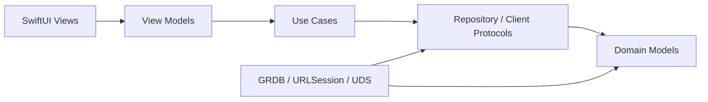

# 모래 Low-Level Design

> 상태: Accepted  
> 최종 수정: 2026-07-30
> 대상: MVP  
> 상위 문서: [README](../README.md), [HLD](HLD.md)  
> 아키텍처 결정: [ADR](adr/)

## 1. 목적과 원칙

이 문서는 모래 MVP를 Swift 코드와 SQLite 스키마로 구현할 수 있는 수준까지 구체화합니다. HLD와 ADR이 정의한 경계를 변경하지 않으며, 상세 설계 결정은 모두 확정되어 있습니다.

구현 원칙:

- UI, 도메인, 저장소, 외부 I/O의 의존 방향을 분리합니다.
- Swift 6 strict concurrency와 `async/await`를 기본으로 사용합니다.
- 네트워크는 수동 브리핑 실행 중에만 사용합니다.
- 원본 Hook/notify payload와 RSS/Atom 응답 body는 메모리에서 처리한 뒤 폐기합니다.
- 사용자 에이전트 작업은 모래의 이벤트 전달 실패 때문에 실패하지 않아야 합니다.
- 시간의 순간은 UTC Unix millisecond, 사용자의 날짜는 `LocalDay`로 명시적으로 구분합니다.

현재 as-built 범위는 Sprint 0부터 Sprint 3.3까지입니다. 따라서 이
문서의 Todo·DB·메뉴 막대 UI, Feed·Article과 수동 Briefing 절은 구현과
동기화돼 있습니다. Agent IPC·알림,
Settings·배포 절은 후속 Sprint의 확정 설계입니다.

## 2. 빌드 단위

MVP는 하나의 Xcode 프로젝트와 세 개의 제품 타깃으로 구성합니다.

```text
Morae.xcodeproj
├── MoraeApp                 macOS application
├── HamsterEventCLI          command-line executable: hamster-event
├── MoraeCore                shared framework/library
├── MoraeAppTests
├── HamsterEventCLITests
└── MoraeCoreTests
```

### 2.1 타깃 책임

| 타깃 | 포함 | 의존 |
| --- | --- | --- |
| `MoraeCore` | 도메인 모델, IPC envelope, 공통 오류, 순수 상태 전이 | Foundation |
| `MoraeApp` | SwiftUI, use case, GRDB, 네트워크, UDS 서버, 알림 | MoraeCore, 외부 패키지 |
| `HamsterEventCLI` | argv/stdin 입력, IPC envelope 생성, UDS 클라이언트 | MoraeCore |

`HamsterEventCLI`은 GRDB와 FeedKit 코드에 의존하지 않습니다.

### 2.2 앱 소스 디렉터리

```text
MoraeApp/
├── App/
│   ├── MoraeApp.swift
│   ├── AppContainer.swift
│   └── AppLifecycleCoordinator.swift
├── Features/
│   ├── MenuBar/
│   ├── Briefing/
│   ├── Tasks/
│   ├── AgentActivity/
│   └── Settings/
├── Application/
│   ├── Briefing/
│   ├── Tasks/
│   └── AgentEvents/
├── Infrastructure/
│   ├── Database/
│   ├── Feeds/
│   ├── AgentIPC/
│   ├── Notifications/
│   └── Logging/
└── Resources/
    ├── DefaultFeeds.json
    └── Localizable.xcstrings
```

### 2.3 외부 패키지

| 패키지 | 용도 | 상태 |
| --- | --- | --- |
| [GRDB.swift](https://github.com/groue/GRDB.swift) | SQLite, migration, observation | 확정 |
| [FeedKit](https://github.com/nmdias/FeedKit) | RSS, Atom 파싱 | 확정 |

패키지는 Swift Package Manager로 추가하고 exact pin이 아니라 호환 가능한 minor 범위로 고정합니다. `Package.resolved`는 저장소에 포함합니다.

## 3. 의존성 규칙



- View는 repository나 URLSession을 직접 호출하지 않습니다.
- ViewModel은 `@MainActor`이며 use case만 호출합니다.
- Application 계층은 protocol에 의존하고 concrete adapter는 `AppContainer`가 주입합니다.
- Domain 타입은 SwiftUI, GRDB, FeedKit을 import하지 않습니다.
- DB record와 네트워크 DTO는 Domain 모델과 분리합니다.

## 4. 공통 값 타입

### 4.1 날짜와 시간

```swift
struct LocalDay: Hashable, Codable, Sendable {
    let rawValue: String // yyyy-MM-dd
}

protocol Clock: Sendable {
    func now() -> Date
    func localDay(for date: Date, calendar: Calendar) -> LocalDay
}
```

- `LocalDay`는 사용자의 현재 `Calendar.autoupdatingCurrent`와 time zone으로 만듭니다.
- Task의 "오늘/어제"는 현재 시스템 time zone을 따릅니다.
- DB의 `*_at_ms` 값은 UTC Unix millisecond입니다.
- 시스템 time zone이 바뀌어도 이미 저장한 `task_day`는 자동 변환하지 않습니다.

### 4.2 식별자

Domain에서는 UUID 문자열을 감싼 타입을 사용합니다.

```swift
struct TodoID: Hashable, Codable, Sendable { let rawValue: UUID }
struct ArticleID: Hashable, Codable, Sendable { let rawValue: UUID }
struct BriefingRunID: Hashable, Codable, Sendable { let rawValue: UUID }
struct AgentRunID: Hashable, Codable, Sendable { let rawValue: UUID }
struct AgentEventID: Hashable, Codable, Sendable { let rawValue: UUID }
```

DB에는 소문자 하이픈 UUID 문자열로 저장합니다.

## 5. Domain 모델

### 5.1 Todo

Swift Concurrency의 `Task`와 이름이 충돌하지 않도록 Swift 타입은 `TodoItem`을 사용하고 DB 테이블은 `tasks`를 사용합니다.

```swift
enum TodoStatus: String, Codable, Sendable {
    case pending
    case completed
}

enum TodoPriority: Int, Codable, Sendable {
    case normal = 0
    case important = 1
}

struct TodoItem: Identifiable, Equatable, Sendable {
    let id: TodoID
    var title: String
    var day: LocalDay
    var status: TodoStatus
    var priority: TodoPriority
    var sortOrder: Int
    var estimatedMinutes: Int?
    var relatedURL: URL?
    var projectPath: String?
    var completedAt: Date?
    let createdAt: Date
    var updatedAt: Date
}
```

검증:

- trim한 title은 1...200자입니다.
- `estimatedMinutes`는 1...1440 또는 nil입니다.
- `completed`이면 `completedAt != nil`, `pending`이면 `completedAt == nil`입니다.
- `relatedURL`은 `https`, `http`, `file`만 허용합니다. 파일을 자동으로 읽지는 않습니다.

### 5.2 Article과 Briefing

```swift
struct Article: Identifiable, Equatable, Sendable {
    let id: ArticleID
    let canonicalURL: URL
    let title: String
    let sourceName: String
    let sourceURL: URL?
    let publishedAt: Date?
    var isRead: Bool
    var isLiked: Bool
    let createdAt: Date
    var updatedAt: Date
}

enum BriefingStatus: String, Codable, Sendable {
    case running
    case succeeded
    case failed
}

struct BriefingRun: Identifiable, Equatable, Sendable {
    let id: BriefingRunID
    let day: LocalDay
    var status: BriefingStatus
    var selectedArticleID: ArticleID?
    let triggeredAt: Date
    var finishedAt: Date?
    var errorCode: BriefingErrorCode?
}
```

### 5.3 AgentRun과 AgentEvent

```swift
enum AgentSource: String, Codable, Sendable {
    case codex
    case claude
}

enum AgentStatus: String, Codable, Sendable {
    case running
    case attentionRequired = "attention_required"
    case responded
    case completed
    case failed
    case cancelled
}

enum AgentClosureReason: String, Codable, Sendable {
    case terminalEvent = "terminal_event"
    case superseded
}

struct AgentRun: Identifiable, Equatable, Sendable {
    let id: AgentRunID
    let source: AgentSource
    let sessionID: String
    let turnID: String
    var projectPath: String?
    var title: String?
    var status: AgentStatus
    var startedAt: Date?
    let receivedAt: Date
    var updatedAt: Date
    var closedAt: Date?
    var closureReason: AgentClosureReason?
    var lastMessage: String?
    var isUnread: Bool
}

struct AgentEvent: Identifiable, Equatable, Sendable {
    let id: AgentEventID
    let agentRunID: AgentRunID
    let eventKey: String
    let sourceEvent: String
    let normalizedStatus: AgentStatus
    let occurredAt: Date
    let receivedAt: Date
}
```

`closedAt`과 `status`는 별개입니다. Claude의 새 `UserPromptSubmit`이 왔는데 이전 열린 턴에 terminal event가 없으면 이전 턴을 `superseded`로 닫되 마지막 status는 유지합니다.

## 6. SQLite 스키마와 마이그레이션

DB 파일:

```text
~/Library/Application Support/Morae/morae.sqlite
```

초기화:

- `FileManager.default.urls(for: .applicationSupportDirectory, in: .userDomainMask)` 아래 `Morae` 디렉터리를 먼저 생성합니다.
- `PRAGMA foreign_keys = ON`
- `PRAGMA journal_mode = WAL`
- `PRAGMA busy_timeout = 3000`
- migration 이름은 `v1_initial`부터 증가시킵니다.

### 6.1 `v1_initial` DDL

```sql
CREATE TABLE tasks (
    id                  TEXT PRIMARY KEY NOT NULL,
    title               TEXT NOT NULL CHECK(length(title) BETWEEN 1 AND 200),
    task_day            TEXT NOT NULL CHECK(length(task_day) = 10),
    status              TEXT NOT NULL CHECK(status IN ('pending', 'completed')),
    priority            INTEGER NOT NULL DEFAULT 0 CHECK(priority IN (0, 1)),
    sort_order          INTEGER NOT NULL,
    estimated_minutes   INTEGER CHECK(estimated_minutes BETWEEN 1 AND 1440),
    related_url         TEXT,
    project_path        TEXT,
    source              TEXT NOT NULL DEFAULT 'manual',
    completed_at_ms     INTEGER,
    created_at_ms       INTEGER NOT NULL,
    updated_at_ms       INTEGER NOT NULL,
    CHECK (
        (status = 'completed' AND completed_at_ms IS NOT NULL)
        OR (status = 'pending' AND completed_at_ms IS NULL)
    )
);

CREATE INDEX idx_tasks_day_status_order
ON tasks(task_day, status, sort_order);

CREATE TABLE feed_sources (
    id                  TEXT PRIMARY KEY NOT NULL,
    name                TEXT NOT NULL,
    feed_url            TEXT NOT NULL UNIQUE,
    is_official         INTEGER NOT NULL DEFAULT 0 CHECK(is_official IN (0, 1)),
    is_enabled          INTEGER NOT NULL DEFAULT 1 CHECK(is_enabled IN (0, 1)),
    last_checked_at_ms  INTEGER,
    created_at_ms       INTEGER NOT NULL,
    updated_at_ms       INTEGER NOT NULL
);

CREATE TABLE articles (
    id                      TEXT PRIMARY KEY NOT NULL,
    canonical_url           TEXT NOT NULL UNIQUE,
    title                   TEXT NOT NULL,
    source_name             TEXT NOT NULL,
    source_url              TEXT,
    published_at_ms         INTEGER,
    is_read                 INTEGER NOT NULL DEFAULT 0 CHECK(is_read IN (0, 1)),
    is_liked                INTEGER NOT NULL DEFAULT 0 CHECK(is_liked IN (0, 1)),
    created_at_ms           INTEGER NOT NULL,
    updated_at_ms           INTEGER NOT NULL
);

CREATE INDEX idx_articles_published
ON articles(published_at_ms DESC);

CREATE TABLE briefing_runs (
    id                  TEXT PRIMARY KEY NOT NULL,
    briefing_day        TEXT NOT NULL CHECK(length(briefing_day) = 10),
    status              TEXT NOT NULL CHECK(status IN (
        'running', 'succeeded', 'failed'
    )),
    selected_article_id TEXT REFERENCES articles(id) ON DELETE SET NULL,
    triggered_at_ms     INTEGER NOT NULL,
    finished_at_ms      INTEGER,
    error_code          TEXT
);

CREATE INDEX idx_briefing_runs_day_triggered
ON briefing_runs(briefing_day, triggered_at_ms DESC);

CREATE TABLE agent_runs (
    id                  TEXT PRIMARY KEY NOT NULL,
    source              TEXT NOT NULL CHECK(source IN ('codex', 'claude')),
    session_id          TEXT NOT NULL,
    turn_id             TEXT NOT NULL,
    project_path        TEXT,
    title               TEXT,
    status              TEXT NOT NULL CHECK(status IN (
        'running', 'attention_required', 'responded',
        'completed', 'failed', 'cancelled'
    )),
    started_at_ms       INTEGER,
    received_at_ms      INTEGER NOT NULL,
    updated_at_ms       INTEGER NOT NULL,
    closed_at_ms        INTEGER,
    closure_reason      TEXT CHECK(closure_reason IN ('terminal_event', 'superseded')),
    last_message        TEXT,
    is_unread           INTEGER NOT NULL DEFAULT 1 CHECK(is_unread IN (0, 1)),
    UNIQUE(source, session_id, turn_id)
);

CREATE INDEX idx_agent_runs_recent
ON agent_runs(updated_at_ms DESC);

CREATE INDEX idx_agent_runs_retention
ON agent_runs(received_at_ms);

CREATE INDEX idx_agent_runs_open_session
ON agent_runs(source, session_id, closed_at_ms);

CREATE TABLE agent_events (
    id                  TEXT PRIMARY KEY NOT NULL,
    agent_run_id        TEXT NOT NULL REFERENCES agent_runs(id) ON DELETE CASCADE,
    event_key           TEXT NOT NULL UNIQUE,
    source_event        TEXT NOT NULL,
    normalized_status   TEXT NOT NULL,
    occurred_at_ms      INTEGER NOT NULL,
    received_at_ms      INTEGER NOT NULL
);

CREATE INDEX idx_agent_events_run_time
ON agent_events(agent_run_id, occurred_at_ms);
```

### 6.2 `v2_unique_carry_over`

```sql
CREATE UNIQUE INDEX idx_tasks_carry_target_source
ON tasks(task_day, source)
WHERE source LIKE 'carryover:%';
```

이 migration은 이월 복사본의 `source` provenance를 이용해 같은 원본을
같은 날짜로 두 번 복사하지 못하게 합니다. v2 이전 복사본은 모두
`source=manual`로 저장돼 원본을 안전하게 역추론할 수 없으므로 자동
backfill하지 않습니다.

### 6.3 `v3_app_metadata`

```sql
CREATE TABLE app_metadata (
    key     TEXT PRIMARY KEY NOT NULL,
    value   TEXT NOT NULL
);
```

초기 공식 문서 피드 구성은 `default_feeds_seeded=1` marker를 사용했습니다.
뉴스레터 호 중심 구성을 거쳐, 개별 글 중심 구성은
`default_feeds_seeded_v3=1` marker를 사용합니다. v3를 처음 적용할 때
기존 공식 문서 피드와 FE News, Frontend Focus, JavaScript Weekly를
비활성화하고 GeekNews와 Korean FE Article을 추가하며 사용자 정의 피드는
유지합니다. 사용자가 v3 기본 피드를 삭제한 뒤 앱을 다시 실행해도 자동
복구하지 않습니다.

### 6.4 `v4_feed_selection_weight`

```sql
ALTER TABLE feed_sources
ADD COLUMN selection_weight INTEGER NOT NULL DEFAULT 0
    CHECK(selection_weight BETWEEN 0 AND 100);
```

큐레이션 서비스의 발행 빈도와 선별 밀도를 선정 점수에 반영합니다.
0은 추가 선호가 없음을 뜻하며 기본 피드는 40...60 범위만 사용합니다.

### 6.5 저장 형식

- Bool은 SQLite INTEGER `0/1`로 저장합니다.
- enum은 정의된 raw string/int로 저장합니다.
- URL은 absolute string으로 저장합니다.
- nullable 개인정보 필드는 opt-in이 꺼지면 새 값부터 nil로 저장합니다.
- opt-in을 끌 때 기존 `project_path`, `title`, `last_message`도 한 트랜잭션에서 NULL로 지웁니다.

### 6.6 데이터 정리

```sql
DELETE FROM agent_runs
WHERE received_at_ms < :cutoff_ms;
```

- cutoff는 `Clock.now() - 90일`입니다.
- FK cascade로 AgentEvent도 함께 삭제합니다.
- 앱 시작 직후 migration이 성공한 다음 한 번 실행합니다.
- 새 AgentEvent 저장 트랜잭션이 끝난 뒤 최대 하루에 한 번 실행합니다.
- 마지막 정리 시각은 표준 UserDefaults에 저장합니다.
- 이 자동 정리는 AgentRun과 FK cascade 대상 AgentEvent에만 적용합니다.
- Task, Article, BriefingRun은 MVP에서 자동 삭제하지 않으며 앱 데이터 초기화 또는 향후 별도 정책으로만 제거합니다.

## 7. 설정

### 7.1 표준 UserDefaults

`UserDefaults.standard`를 사용하며 별도 suite나 App Group entitlement를 만들지 않습니다.

키:

| 키 | 타입 | 기본값 |
| --- | --- | --- |
| `settings.schemaVersion` | Int | 1 |
| `settings.launchAtLogin` | Bool | false |
| `settings.interests` | `[String]` | `[]` |
| `privacy.storeProjectPath` | Bool | false |
| `privacy.storeAgentTitle` | Bool | false |
| `privacy.storeLastMessage` | Bool | false |
| `privacy.showDetailsInNotification` | Bool | false |
| `maintenance.lastAgentPruneAtMs` | Int64 | 0 |

피드 목록은 정렬, 활성화와 HTTP cache metadata가 필요하므로 UserDefaults가 아니라 `feed_sources` 테이블에 저장합니다.

## 8. Repository와 Port

### 8.1 Task

```swift
protocol TodoRepository: Sendable {
    func list(day: LocalDay) async throws -> [TodoItem]
    func listCompleted(day: LocalDay) async throws -> [TodoItem]
    func listCarryOverCandidates(
        from: LocalDay,
        to: LocalDay
    ) async throws -> [TodoItem]
    func insert(_ item: TodoItem) async throws
    func update(_ item: TodoItem) async throws
    func delete(id: TodoID) async throws
    func reorder(day: LocalDay, orderedIDs: [TodoID]) async throws
    func carryOverPending(from: LocalDay, to: LocalDay) async throws
}
```

`reorder`는 해당 날짜의 모든 ID가 정확히 한 번 포함되었는지 검증하고 단일 트랜잭션으로 `sort_order`를 0부터 재지정합니다.

이월 복사본의 `source`는 `carryover:<원본 task id>` 형식으로 저장합니다.
후보 조회에서는 오늘 이미 복사된 원본을 제외하고, 부분 unique index로 같은
날짜에 동일한 원본이 두 번 복사되지 않도록 보장합니다.

### 8.2 Article과 Briefing

```swift
protocol FeedSourceRepository: Sendable {
    func enabledSources() async throws -> [FeedSource]
    func markChecked(id: UUID, at: Date) async throws
}

protocol ArticleRepository: Sendable {
    func previouslyRecommendedURLs() async throws -> Set<URL>
    func readURLs() async throws -> Set<URL>
    func upsert(_ article: Article) async throws
    func find(canonicalURL: URL) async throws -> Article?
    func setRead(canonicalURL: URL, isRead: Bool, at: Date) async throws
    func setLiked(canonicalURL: URL, isLiked: Bool, at: Date) async throws
}

protocol BriefingRepository: Sendable {
    func createRunning(day: LocalDay, at: Date) async throws -> BriefingRun
    func finish(
        run: BriefingRun,
        article: Article?
    ) async throws
    func latest(day: LocalDay) async throws -> BriefingRun?
}
```

`finish`는 BriefingRun과 Article upsert를 같은 GRDB write transaction에서 처리합니다.

### 8.3 Agent

```swift
protocol AgentRepository: Sendable {
    func apply(_ event: NormalizedAgentEvent) async throws -> AgentApplyResult
    func recent(limit: Int) async throws -> [AgentRun]
    func markAllRead() async throws
    func prune(receivedBefore cutoff: Date) async throws -> Int
}

struct AgentApplyResult: Sendable {
    let run: AgentRun
    let insertedEvent: Bool
    let shouldNotify: Bool
}
```

`apply`는 턴 연결, 상태 전이, AgentEvent insert와 AgentRun update를 하나의 write transaction에서 수행합니다.

## 9. Application Use Cases

### 9.1 Todo use cases

- `CreateTodo`
- `UpdateTodo`
- `ToggleTodoCompletion`
- `DeleteTodo`
- `ReorderTodos`
- `CarryOverPendingTodos`
- `BuildLocalTaskSummary`

`BuildLocalTaskSummary` 출력:

```swift
struct LocalTaskSummary: Equatable, Sendable {
    let yesterdayCompleted: [TodoItem]
    let todayPending: [TodoItem]
    let todayCompletedCount: Int
    let todayEstimatedMinutes: Int
    let mostImportantTodoID: TodoID?
}
```

중요 항목 우선, `sortOrder` 순으로 정렬합니다.

### 9.2 GenerateBriefing

```swift
actor GenerateBriefing {
    func execute(day: LocalDay) async -> BriefingResult
}
```

동작:

1. actor 내부 `activeRunID`가 있으면 `.alreadyRunning`을 반환합니다.
2. `BriefingRun.running`을 먼저 저장합니다.
3. 로컬 task summary를 조회합니다.
4. enabled feed를 최대 4개 동시 요청합니다.
5. 후보를 정규화하고 하나를 선정합니다.
6. 선택된 아티클의 제목, 링크, 출처와 게시일을 저장합니다.
7. 결과를 `succeeded` 또는 `failed`로 저장합니다.
8. `defer`에서 `activeRunID`를 해제합니다.

사용자가 메뉴 창을 닫아도 실행은 앱 수명 동안 계속됩니다. 앱 종료 시 작업은 취소되며 다음 실행에서 자동 재개하지 않습니다.

### 9.3 ReceiveAgentEvent

```swift
actor ReceiveAgentEvent {
    func execute(_ envelope: AgentTransportEnvelope) async -> AgentIngressAck
}
```

순서:

1. transport version과 source를 검증합니다.
2. raw JSON을 source-specific DTO로 decode합니다.
3. 개인정보 설정을 읽습니다.
4. `NormalizedAgentEvent`로 변환하며 허용하지 않은 필드는 nil 처리합니다.
5. repository transaction을 실행합니다.
6. 실제로 새 상태가 저장되고 `shouldNotify`인 경우에만 알림을 요청합니다.
7. raw DTO와 Data의 참조를 함수 종료 시 해제합니다.
8. 저장 성공 ACK를 반환합니다.

## 10. 수동 브리핑 상세 설계

### 10.1 HTTP client

```swift
protocol HTTPClient: Sendable {
    func data(for request: URLRequest) async throws -> (Data, HTTPURLResponse)
}
```

URLSession 설정:

- request timeout: 10초
- resource timeout: 30초
- cookie storage: nil
- credential storage: nil
- cache policy: `.useProtocolCachePolicy`
- URLCache: memory 8 MiB, disk 32 MiB
- 최대 응답 크기: feed 2 MiB
- User-Agent: `Morae/<app-version> macOS/<os-version>`
- HTTPS만 허용합니다.
- redirect 후 최종 URL도 HTTPS인지 확인합니다.

feed 요청의 ETag와 Last-Modified 처리는 URLSession/URLCache에 맡깁니다. 앱 DB에는 원본 feed body를 저장하지 않습니다. 캐시를 사용할 수 없는 `304` 응답은 해당 source 실패로 처리하고 다른 source 후보를 계속 사용합니다.

### 10.2 기본 피드와 Feed mapping

2026-07-30에 다음 큐레이션 서비스의 공식 HTTPS 피드와 XML 응답을
확인했습니다.

| 출처 | 피드 URL | selectionWeight |
| --- | --- | ---: |
| GeekNews | `https://news.hada.io/rss/news` | 40 |
| Korean FE Article | `https://kofearticle.substack.com/feed` | 60 |

위 표의 세 번째 값은 `selectionWeight`입니다. 두 소스 모두 뉴스레터의
호 목록이 아니라 하나의 토픽 또는 작성·번역된 개별 글을 추천 단위로
제공합니다. Korean FE Article 제목의 반복 접두어
`[Korean FE Article]`은 화면 표시 전에 제거합니다. MVP는 제목, 링크,
출처와 게시일만 표시하고 피드 본문·요약, 이미지, 로고와 아티클 원문은
사용하지 않습니다. 기본 피드 fixture는 실제 콘텐츠를 복사하지 않고
자체 제작합니다.

모든 feed 형식은 다음 중간 모델로 변환합니다.

```swift
struct FeedCandidate: Hashable, Sendable {
    let sourceID: UUID
    let sourceName: String
    let sourceURL: URL
    let articleURL: URL
    let title: String
    let publishedAt: Date?
    let isOfficialSource: Bool
    let selectionWeight: Int
}
```

필수값:

- article URL
- trim 후 1...300자의 title
- 게시일

날짜 파싱이 실패한 항목과 실행 시점 기준 30일보다 오래된 항목은 선정
후보에서 제외합니다. 피드 서버의 시계 오차를 고려해 미래 게시일은
하루까지 허용합니다.

### 10.3 URL canonicalization

1. scheme과 host를 소문자로 만듭니다.
2. fragment를 제거합니다.
3. 기본 포트 80/443을 제거합니다.
4. path가 비어 있으면 `/`로 만듭니다.
5. query에서 `utm_*`, `fbclid`, `gclid`, `ref`를 제거합니다.
6. 나머지 query item은 이름과 값 순으로 정렬합니다.

### 10.4 선정 점수

```text
score =
    freshness(0...50)
  + topicPriority(0, 20, 45, or 120)
  + interestMatch(0...25)
  + officialSource(0 or 15)
  + selectionWeight(0...100)
  + unreadBonus(0 or 10)
  - recentlyRecommendedPenalty(0 or 60)
```

freshness:

| 게시 경과 | 점수 |
| --- | --- |
| 0~1일 | 50 |
| 2~3일 | 40 |
| 4~7일 | 30 |
| 8~14일 | 15 |
| 15~30일 | 0 |

- 날짜 없음, 30일 초과, 하루보다 먼 미래 게시일은 점수 계산 전에
  제외합니다.

- topicPriority:

  | 우선순위 | 점수 | 제목 분류 예시 |
  | --- | ---: | --- |
  | AI·프론트엔드 | 120 | AI, LLM, agent, MCP, browser, web, React, JavaScript, CSS |
  | 협업 | 45 | collaboration, team, code review, developer experience, 생산성 |
  | 인프라·데이터 | 20 | cloud, Kubernetes, observability, database, data |
  | 기타 | 0 | 위 키워드에 해당하지 않는 제목 |

- 둘 이상의 분류에 해당하면 가장 높은 점수 하나만 사용합니다.
- 영문 키워드에 한글 조사가 붙은 경우(`AI로`, `React를`)도 영문
  토큰으로 분리합니다.
- `ArticleTopicClassifier`가 제목을 네 주제로 분류하고,
  `ArticleSelector`는 반환된 점수를 나머지 선정 신호와 합산합니다.
- 이 분류는 제목 메타데이터만 사용합니다. 본문 의미 분석이나 외부 AI
  API 호출은 하지 않습니다.
- interest는 title의 case-insensitive token match 비율로 계산합니다.
- selectionWeight는 source 설정에서 후보로 전달하며 기본값은 0입니다.
- 최근 90일 추천 URL에는 60점 감점합니다.
- 모든 후보가 최근 추천 글이면 감점을 제거하고 가장 높은 후보를 사용합니다.
- 동점은 `publishedAt DESC`, `canonicalURL ASC`로 결정해 결과를 재현 가능하게 합니다.

## 11. Agent IPC

### 11.1 socket 경로

```text
$TMPDIR/morae-<uid>/event.sock
```

앱 시작:

1. `lstat`으로 부모와 기존 socket이 symlink가 아닌지 확인합니다.
2. 부모가 없으면 mode `0700`으로 생성합니다.
3. 부모와 socket의 owner UID가 현재 UID인지 확인합니다.
4. 안전한 기존 socket만 unlink합니다.
5. `AF_UNIX`, `SOCK_STREAM` socket을 bind/listen합니다.
6. socket mode를 `0600`으로 변경합니다.

서버는 `getpeereid`로 peer UID를 검사합니다.

### 11.2 transport envelope

```swift
struct AgentTransportEnvelope: Codable, Sendable {
    let transportVersion: Int
    let source: AgentSource
    let eventHint: String
    let receivedAtMs: Int64
    let rawPayload: Data
}
```

JSON에서 `rawPayload`는 base64 string입니다. base64는 payload를 로그나 DB에 저장하기 위한 것이 아니라 envelope 안에서 원본 bytes를 손실 없이 전달하기 위한 방식입니다.

### 11.3 framing

```text
┌────────────────────────┬──────────────────────────────┐
│ payload length: UInt32 │ envelope JSON UTF-8 bytes    │
│ network byte order     │ 1...1,048,576 bytes          │
└────────────────────────┴──────────────────────────────┘
```

- helper 시작 시 monotonic total deadline을 900ms로 설정
- connect는 최대 250ms 또는 남은 total deadline 중 짧은 값
- write와 ACK read는 별도 고정 timeout을 더하지 않고 남은 total deadline을 공유
- 서버 connection당 frame 1개
- 앱은 동시에 최대 8 connection을 처리
- 최대 크기를 넘으면 body를 읽지 않고 연결 종료

ACK:

```json
{"ok":true,"eventId":"6c214fd5-ae11-4a97-8145-004ce05ce20f"}
```

오류 ACK:

```json
{"ok":false,"code":"invalid_payload"}
```

helper는 성공, 전달 실패, 잘못된 subcommand, 잘못된 payload를 포함한 모든 호출에서 stdout/stderr 출력 없이 exit code 0으로 종료합니다. Hook 설정 검증은 앱 설정 화면의 설치 확인 기능과 문서로 제공하며 에이전트 프로세스에는 실패를 전파하지 않습니다.

### 11.4 CLI 입력

| 호출 | source | 입력 |
| --- | --- | --- |
| `hamster-event '<json>'` | Codex | `argv[1]` |
| `hamster-event claude-turn-start` | Claude | stdin |
| `hamster-event claude-notification` | Claude | stdin |
| `hamster-event claude-task-completed` | Claude | stdin |
| `hamster-event claude-stop` | Claude | stdin |
| `hamster-event claude-stop-failure` | Claude | stdin |

입력은 읽는 즉시 760 KiB 제한을 적용하며 helper 로그에 남기지 않습니다. Base64 인코딩과 envelope 메타데이터를 포함한 최종 JSON frame을 다시 측정해 1 MiB를 넘으면 전송하지 않고 정상 종료합니다.

## 12. Source DTO와 정규화

### 12.1 Codex DTO

```swift
struct CodexNotifyDTO: Decodable {
    let type: String
    let threadID: String
    let turnID: String
    let cwd: String?
    let inputMessages: [String]?
    let lastAssistantMessage: String?
}
```

CodingKeys는 kebab-case 원본 필드를 매핑합니다.

정규화:

- `type`이 `agent-turn-complete`가 아니면 reject
- status `responded`
- occurredAt은 source에 없으므로 helper의 receivedAt 사용
- eventKey: `codex:<threadID>:<turnID>:agent-turn-complete`
- startedAt nil, closedAt receivedAt

### 12.2 Claude 공통 DTO

```swift
struct ClaudeHookDTO: Decodable {
    let sessionID: String
    let promptID: String?
    let cwd: String?
    let hookEventName: String
    let lastAssistantMessage: String?
    let notificationType: String?
    let taskID: String?
    let error: String?
}
```

필요한 source-specific 필드만 decode하며 `transcript_path`는 모델에 선언하지 않습니다.

### 12.3 Claude 턴 연결

Claude Code 2.1.196 이상이 제공하는 `prompt_id`를 `turnID`로 우선 사용합니다. 값이 UUID 문자열이 아니어도 비어 있지 않고 128자 이하라면 opaque identifier로 그대로 보존합니다.

`UserPromptSubmit`:

1. `prompt_id`가 있으면 그 값을, 없으면 UUID를 `turnID`로 정합니다.
2. 같은 `(sessionID, turnID)` start eventKey가 있으면 중복으로 무시합니다.
3. 같은 session의 다른 열린 run이 있으면 `closedAt=now`, `closureReason=superseded`로 닫습니다.
4. 정한 `turnID`로 `running` AgentRun을 생성합니다.

후속 event:

1. `prompt_id`가 있으면 같은 `(sessionID, turnID)` run을 조회합니다.
2. `prompt_id`가 없으면 같은 session의 최신 열린 run을 조회합니다.
3. 대상 run이 없으면 원본 `prompt_id` 또는 새 UUID의 폴백 run을 생성합니다.
4. Notification은 `permission_prompt`, `elicitation_dialog`, `agent_needs_input`만 `attention_required`로 허용하고 나머지 type은 reject합니다. `agent_needs_input`은 Claude Code 2.1.198 이상에서만 발생합니다.
5. TaskCompleted는 `completed`.
6. Stop은 `responded`, closedAt 설정.
7. StopFailure는 `failed`, closedAt 설정.

상태 rank:

```swift
failed = 50
completed = 40
responded = 30
attentionRequired = 20
running = 10
cancelled = 0 // MVP에서 source mapping 없음
```

새 rank가 낮으면 AgentEvent는 저장하되 AgentRun status는 유지하고 알림도 만들지 않습니다.

eventKey:

| Event | Key |
| --- | --- |
| UserPromptSubmit | `claude:<session>:<turn>:start` |
| Stop | `claude:<session>:<turn>:stop` |
| StopFailure | `claude:<session>:<turn>:failure:<error>` |
| TaskCompleted | `claude:<session>:<turn>:task:<taskID>` |
| Notification | `claude:<session>:<turn>:notification:<type>:<messageSHA256>` |

message hash는 중복 억제에만 사용하고 원문 복원이 불가능한 SHA-256 hex로 계산합니다.

## 13. 개인정보 필드 처리

```swift
struct AgentPrivacyPolicy: Sendable {
    let storeProjectPath: Bool
    let storeAgentTitle: Bool
    let storeLastMessage: Bool
    let showDetailsInNotification: Bool
}
```

정규화 순서:

1. 원본 DTO에서 필수 식별자와 상태를 읽습니다.
2. projectPath는 opt-in일 때만 표준화 후 복사합니다.
3. title은 opt-in일 때만 첫 사용자 메시지 또는 task subject에서 최대 200자로 만듭니다.
4. lastMessage는 opt-in일 때만 제어 문자를 제거하고 최대 1,000자로 자릅니다.
5. 원본 DTO는 repository 호출 전에 `NormalizedAgentEvent`로 대체합니다.
6. 정책을 끄면 기존 nullable 개인정보 열을 일괄 NULL 처리합니다.

path 표준화는 `standardizingPath`까지만 수행하고 파일 존재 확인이나 파일 읽기는 하지 않습니다. UI에는 기본적으로 마지막 두 path component만 표시합니다.

## 14. 알림

권한:

1. 첫 에이전트 연동 온보딩에서 이유를 설명합니다.
2. 사용자 동작 후 `requestAuthorization`을 호출합니다.
3. 거부된 경우 재호출을 반복하지 않고 System Settings 이동 안내를 표시합니다.

category:

```text
MORAE_AGENT_EVENT
```

userInfo:

```json
{
  "destination": "agent-list",
  "agentRunID": "optional-uuid"
}
```

MVP는 `destination`만 사용하고 agentRunID 상세 딥링크는 2단계까지 무시합니다.

기본 문구:

| 상태 | 제목 | 본문 |
| --- | --- | --- |
| responded | `{source} 응답이 끝났어요.` | `모래에서 최근 기록을 확인해 주세요.` |
| completed | `{source} 작업이 완료됐어요.` | `모래에서 최근 기록을 확인해 주세요.` |
| failed | `{source} 작업이 중단됐어요.` | `모래에서 상태를 확인해 주세요.` |
| attention_required | `{source} 확인이 필요해요.` | `에이전트 화면을 확인해 주세요.` |

알림 상세 opt-in이 켜져도 title은 120자, body는 240자로 제한합니다.

알림 중복 억제:

- duplicate eventKey는 알림 없음
- rank가 낮아진 event는 알림 없음
- 같은 Claude turn의 TaskCompleted 뒤 Stop은 알림 없음
- Notification은 같은 eventKey를 5분 안에 다시 받으면 알림 없음

## 15. SwiftUI 화면 설계

### 15.1 Scene

```swift
@main
struct MoraeApp: App {
    var body: some Scene {
        MenuBarExtra("모래", systemImage: menuBarIcon) {
            MenuBarRootView()
        }
        .menuBarExtraStyle(.window)

        Settings {
            SettingsRootView()
        }
    }
}
```

메뉴 막대 아이콘은 미확인 AgentRun이 있으면 filled variant 또는 overlay dot를 사용합니다.

### 15.2 MenuBarRootView

상단:

- 날짜
- "오늘 브리핑 만들기" 버튼
- 실행 중 progress
- 설정 버튼

본문 section:

1. 오늘의 아티클
2. 어제 완료
3. 오늘 할 일
4. 최근 에이전트 기록

현재 메뉴 창 크기는 392×700pt이며 내용은 ScrollView로 표시합니다.

### 15.3 Briefing 상태

```swift
enum BriefingViewState: Equatable {
    case idle(previous: GeneratedBriefing?)
    case loading(previous: GeneratedBriefing?)
    case success(GeneratedBriefing)
    case failure(FailedBriefing, previous: GeneratedBriefing?)
}
```

- loading 중 버튼을 disable합니다.
- retry 버튼은 표시하지 않습니다.
- 이전 브리핑이 있으면 loading 중에도 흐리게 유지합니다.
- 새 실행이 끝나면 같은 날짜의 최신 결과로 교체합니다.
- 버튼을 누르면 별도 질문 없이 브리핑 생성을 한 번 시작합니다.
- 오늘의 아티클 섹션에는 추천 카드 또는 아티클 상태만 표시합니다.
  로컬 할 일은 어제 완료와 오늘 할 일 섹션에서 독립적으로 표시합니다.

### 15.4 Todo 편집

- 빠른 추가는 inline TextField입니다.
- Return으로 저장, Escape로 취소합니다.
- title validation 오류는 inline으로 표시합니다.
- pointer reorder는 pending 목록 안에서만 허용합니다.
- `MenuBarExtra(.window)`의 시스템 drop routing에 의존하지 않고, 행의
  3pt threshold `DragGesture`와 named coordinate space의 row frame을
  사용해 삽입 위치를 계산합니다.
- drag 중 원본 행을 흐리게 하고 반투명 preview를 포인터와 함께 이동하며,
  유효한 삽입 위치에 2pt 소프트 블루 divider를 표시합니다.
- mouse-up에서 유효한 위치가 확정된 경우에만 repository reorder를 한 번
  호출합니다.
- 6-dot handle은 이동 가능성을 나타내고, keyboard/VoiceOver에는 위·아래
  이동 action을 제공합니다.
- 완료 토글 시 `completedAt=now`.
- 완료 취소 시 `completedAt=nil`.
- 삭제는 undo 가능한 로컬 UI action으로 5초 제공하되 DB 삭제는 즉시 수행하고 undo 시 새 insert합니다.

### 15.5 Agent 기록

- 최근 20개를 `updatedAt DESC`로 표시합니다.
- projectPath opt-in이 켜지면 path의 마지막 두 component로 그룹핑합니다.
- opt-in이 꺼지면 source별로 그룹핑합니다.
- 리스트를 열면 현재 표시된 run을 read로 표시합니다.
- status는 색상만으로 구분하지 않고 icon과 문구를 함께 사용합니다.

### 15.6 Settings

탭:

- General: 로그인 실행
- Briefing: 관심 분야, feed source
- Agents: Hook 스니펫, socket 상태, 마지막 수신 시각
- Privacy: nullable 필드 저장과 상세 알림 opt-in
- About: 버전, DB schema version, 공식 문서 링크

## 16. ViewModel과 관찰

```swift
@MainActor
@Observable
final class MenuBarViewModel {
    private(set) var briefingState: BriefingViewState
    private(set) var todayTodos: [TodoItem]
    private(set) var recentAgentRuns: [AgentRun]
    private(set) var hasUnreadAgentRun: Bool

    func onAppear() async
    func generateBriefing() async
    func addTodo(title: String) async
    func toggleTodo(id: TodoID) async
    func openAgentList() async
}
```

- GRDB ValueObservation adapter가 tasks, 최신 briefing, 최근 agent_runs 변화를 AsyncSequence로 노출합니다.
- ViewModel은 observation task를 보관하고 deinit 또는 앱 종료 시 cancel합니다.
- DB callback에서 직접 UI state를 변경하지 않고 MainActor로 전달합니다.
- 메뉴 창이 닫혀도 AgentEventService와 socket server는 AppLifecycleCoordinator가 유지합니다.

## 17. AppContainer

```swift
@MainActor
final class AppContainer {
    let clock: Clock
    let settings: SettingsStore
    let database: AppDatabase
    let todoRepository: TodoRepository
    let briefingRepository: BriefingRepository
    let agentRepository: AgentRepository
    let generateBriefing: GenerateBriefing
    let receiveAgentEvent: ReceiveAgentEvent
    let socketServer: AgentSocketServer
    let notifier: AgentNotifier
}
```

초기화 순서:

1. 사용자 Application Support 아래 `Morae` 디렉터리 생성·접근 확인
2. `UserDefaults.standard` 기반 설정 저장소 생성
3. DB open
4. migration
5. 90일 retention 정리
6. repository/use case 조립
7. notification delegate 등록
8. socket server 시작
9. UI scene 제공

DB open 또는 migration이 실패하면 socket server와 네트워크 기능을 시작하지 않고 복구 안내 UI를 표시합니다.

## 18. 오류 모델

```swift
enum BriefingErrorCode: String, Codable, Sendable {
    case noEnabledFeeds = "no_enabled_feeds"
    case noCandidates = "no_candidates"
    case feedUnavailable = "feed_unavailable"
    case persistenceFailed = "persistence_failed"
}

enum AgentIngressErrorCode: String, Codable, Sendable {
    case unsupportedTransport = "unsupported_transport"
    case payloadTooLarge = "payload_too_large"
    case invalidPayload = "invalid_payload"
    case unsupportedEvent = "unsupported_event"
    case peerRejected = "peer_rejected"
    case persistenceFailed = "persistence_failed"
}
```

- 사용자 UI에는 복구 행동이 있는 메시지만 표시합니다.
- 내부 error description은 OSLog에 privacy `.private` 또는 redacted 형태로 기록합니다.
- 원본 Hook payload와 피드 body는 Error의 associated value로 보관하지 않습니다.

## 19. OSLog

subsystem:

```text
io.github.heejung-29cm.morae
```

categories:

- `app-lifecycle`
- `database`
- `briefing`
- `feed`
- `agent-ipc`
- `agent-normalization`
- `notification`

허용되는 필드:

- event/result type
- duration
- byte count
- HTTP status
- DB migration version
- count
- public error code

금지 필드:

- feed 본문·요약
- 전체 URL query
- user prompt와 assistant message
- 전체 project path
- raw Hook payload

## 20. 테스트 상세

### 20.1 MoraeCoreTests

- LocalDay 생성과 time zone 변경
- URL canonicalization과 입력 순서에 독립적인 feed candidate deduplication
- 제목 기반 아티클 주제 분류와 우선순위
- 고정 Clock 기반 아티클 선정 점수와 동점 규칙
- Todo validation
- Agent status rank
- transport envelope encode/decode
- source DTO fixture decode
- eventKey 생성
- Claude open turn 연결과 supersede

### 20.2 DatabaseTests

- `v1_initial`, `v2_unique_carry_over`, `v3_app_metadata` fresh migration
- 모든 CHECK/UNIQUE/FK 제약
- 이월 provenance, 반복 요청 idempotency와 후보 목록 제외
- 기본 피드 one-time seed와 Article canonical URL unique upsert
- Article 읽음·좋아요와 최근 90일 추천 조회
- BriefingRun + Article transaction rollback
- AgentRun + AgentEvent atomic apply
- duplicate eventKey idempotency
- privacy opt-out NULL scrub
- 90일 경계: cutoff 직전 유지, cutoff 이전 삭제
- AgentRun 삭제 시 AgentEvent cascade

### 20.3 FeedTests

fixture:

- RSS 2.0
- Atom
- 제목 누락
- 누락 날짜
- 잘못된 URL
- 2 MiB 초과
- 304 response
- RSS/Atom 통합 fixture의 결정론적 선정과 metadata-only 모델

### 20.4 AgentIPCTests

- partial header/body read
- network byte order length
- 원본 입력 0 byte/760 KiB/초과 및 envelope 1 MiB 경계
- invalid base64
- wrong transport version
- peer UID rejection
- app 미실행·ACK 지연 시 process 시작 후 900ms deadline 안에 종료
- 잘못된 subcommand와 payload도 출력 없이 exit code 0
- ACK 성공/오류/timeout
- stdout/stderr에 payload가 없는지 확인

### 20.5 UI 테스트

- 첫 실행 empty state
- todo CRUD/reorder
- 브리핑 loading 중 중복 tap 방지
- 피드 실패 상태에 retry 버튼 없음
- notification denied fallback dot
- privacy off에서 generic agent row
- VoiceOver label과 keyboard navigation

## 21. 완료 정의

구현 단위 완료 조건:

| 단위 | 완료 조건 |
| --- | --- |
| Database | v1/v2/v3 migration과 repository integration test 통과 |
| Todo | CRUD, reorder, carry-over, local summary 동작 |
| Briefing | 수동 피드 조회 1회, 메타데이터 선정·저장과 무재시도 검증 |
| Agent IPC | Codex/Claude fixture end-to-end 저장과 알림 |
| Privacy | opt-in 기본 off, scrub와 로그 redaction 검증 |
| Distribution | 본인 전용 DMG를 만들고 사용자 앱 디렉터리에서 실행 |

최종 인수는 [README MVP 완료 조건](../README.md#12-mvp-완료-조건)을 따릅니다.

## 22. 요구사항 추적

| 요구사항 | 구현 |
| --- | --- |
| 한 일/할 일 요약 | TodoRepository, BuildLocalTaskSummary, MenuBarRootView |
| 수동 아티클 추천 | GenerateBriefing, FeedClient, ArticleTopicClassifier, ArticleSelector |
| Codex 종료 알림 | HamsterEventCLI, CodexNormalizer, AgentNotifier |
| Claude 종료·완료·실패 | ClaudeNormalizer, turn correlation, AgentRepository |
| 앱 실행 중만 수신 | UDS server, no spool/retry |
| 최소 저장 | AgentPrivacyPolicy, nullable columns, scrub |
| 90일 보존 | AgentRepository.prune, app launch maintenance |

## 23. 상세 설계 결정

### T-001 Xcode 모듈 구성

- 결정: `MoraeApp`, `HamsterEventCLI`, `MoraeCore` 세 타깃을 하나의 Xcode 프로젝트에 구성합니다.
- 근거: MVP의 빌드와 서명 구성을 단순하게 유지하면서 공통 IPC 타입을 공유할 수 있습니다.
- 상태: Accepted

### T-002 피드 파싱 의존성

- 결정: FeedKit으로 RSS/Atom의 제목, 링크, 출처와 게시일을 파싱합니다.
- 근거: RSS/Atom 형식 변형 처리 코드를 직접 유지하는 범위를 줄일 수 있습니다.
- 상태: Accepted

### T-003 Bundle ID 조직 식별자

다음 식별자를 사용합니다.

```text
Bundle ID: io.github.heejung-29cm.morae
OSLog subsystem: io.github.heejung-29cm.morae
```

실제 인터넷 도메인을 구매하거나 웹사이트를 운영할 필요는 없습니다. reverse-DNS 문자열은 앱과 로컬 서비스 이름을 일관되게 구분하기 위한 식별자입니다. 이 값으로 Bundle ID와 OSLog subsystem을 확정합니다.

- 상태: Accepted

## 24. 구현 시점 확인 항목

아래는 아키텍처 결정이 아니라 구현 직전 공식 문서에서 확인할 값입니다.

- macOS 14를 지원하는 GRDB와 FeedKit 호환 버전
- 공개 배포나 WidgetKit 요구가 생기면 ADR-0009에 따라 Developer ID·공증 또는 App Group과 데이터 이전을 재검토
